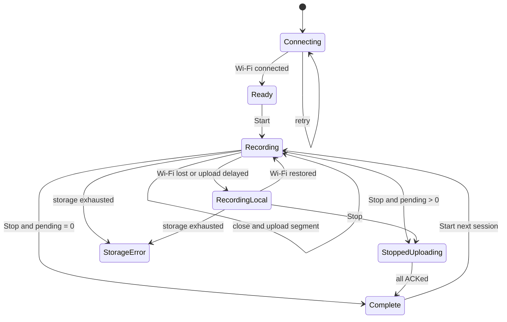

# ESP32 Device-to-Cloud Audio Demo Design

> **Status:** v1 · Partially implemented
> **Date:** 2026-07-14
> **Role:** This document describes how the agreed demo contract in
> [spec.md](spec.md) is or will be implemented. It does not redefine that
> contract. Proposed changes are agreed first in [idea.md](idea.md), promoted
> into the spec, and only then reflected here.

This design is intentionally small. It describes one board, one audio format,
one upload protocol, one uploader worker, and one filesystem-backed receiver.
It is not a production-cloud design.

## Status vocabulary

| Label | Meaning |
| --- | --- |
| **Required design** | Behavior required by the agreed spec, whether or not the current code provides it. |
| **Implemented** | Present in the current source and covered by compilation, static inspection, or receiver tests. |
| **Partial** | Supporting code exists, but the complete required behavior is missing. |
| **Unverified** | Correctness depends on running the physical board and has no recorded acceptance evidence yet. |

## 1. Demo guardrails and principles

1. Audio capture between Start and Stop is the highest-priority behavior.
2. Only a closed WAV segment may cross the network boundary.
3. Upload failures are isolated from capture while local storage remains.
4. An acknowledged segment may be deleted; an unacknowledged closed segment
   may not be silently deleted or overwritten.
5. The simplest path that proves the contract wins. There is no WebSocket
   transport, codec, playback path, database, Redis, account system,
   dashboard, distributed queue, or production platform.
6. Build and unit-test success are software evidence, not physical-demo
   acceptance.

The only supported device is the ESP32-S3-Touch-AMOLED-1.75C. The fixed first
proof format is 16 kHz, 16-bit, two-channel PCM in WAV containers, divided into
nominal 10-second segments. Any future format, codec, DSP, or duration change
must first satisfy the gates in the spec.

## 2. End-to-end architecture

```mermaid
flowchart LR
    U["User: Start / Stop"] --> UI["Device UI state"]
    MIC["Board microphone + I2S"] --> CAP["High-priority capture task"]
    UI --> CAP
    CAP --> ACTIVE["Active WAV on SPIFFS"]
    ACTIVE -->|"close header + metadata"| CLOSED["Durable closed segment"]
    CLOSED --> Q["Sequential uploader"]
    Q -->|"HTTP POST over Wi-Fi"| API["Minimal FastAPI receiver"]
    API --> VAL["Token, checksum, WAV, metadata validation"]
    VAL --> STORE["Run directory on local filesystem"]
    STORE -->|"matching SEGMENT_ACK"| Q
    Q -->|"after ACK: delete WAV, then metadata"| CLOSED
```



While the uploader handles segment *N*, the capture task writes segment
*N + 1*. The active file is never put on the upload queue. The receiver returns
a normal JSON acknowledgment only after it has accepted the complete WAV and
written its artifacts.

### Required topology

| Boundary | Choice |
| --- | --- |
| Device | One ESP32-S3-Touch-AMOLED-1.75C |
| Network | Device joins one preconfigured Wi-Fi network in STA/client mode |
| Transport | Sequential HTTP POST of closed WAV files |
| Demo endpoint | `http://192.168.15.195:8000/v1/device/audio-segments` on the same LAN |
| Receiver | One FastAPI process for one demo device |
| Persistence | SPIFFS on device; ordinary files on receiver |

## 3. Device UI state machine

### Required design



The user-facing text is limited to:

- `Connecting to Wi-Fi`, `Ready`, and Wi-Fi `Connected` or `Offline` status;
- `Recording` or `Recording · uploading segment N`;
- `Wi-Fi lost · recording locally` and `Upload error` without ending capture;
- `Stopped · uploading N`; and
- `Complete · N segments uploaded` only when the pending count is zero.

Start is enabled only when Wi-Fi is connected and no previous session has
pending files. Stop is enabled only during capture. Display sleep is a
presentation-only transition: it must not change capture, upload, session, or
button state. During recording, a double-tap wakes the display without issuing
Start or Stop.

### Current implementation

**Partial.** The LVGL interface has only Start and Stop, shows a Recording
duration, and retains the 10-second display sleep plus double-tap wake behavior.
It does not expose Wi-Fi state or uploaded/pending counts. It enters `Ready`
before deferred Wi-Fi startup, enables Start without checking connectivity, and
returns its internal state to `Ready` as soon as Stop finalizes the active
file. It therefore lacks the required `Stopped · uploading N` and `Complete · N
segments uploaded` progression. Uploader failures are logged and counted but
never reported to LVGL, so the required `Upload error` presentation is also
missing.

## 4. Audio capture and segment lifecycle

### Required lifecycle

1. Start creates a unique run ID, resets the run's segment index to 1, and
   opens a WAV with a placeholder 44-byte header.
2. The I2S capture path appends PCM samples without waiting for network work.
3. At the fixed segment boundary, the device rewrites the WAV header, flushes
   and closes the file, persists its upload metadata, and makes it eligible for
   upload.
4. The next segment opens immediately and receives the next sample exactly
   once. Word boundaries do not affect segmentation.
5. Stop ends capture, closes the current partial segment, and leaves all closed
   files eligible for background upload.

### Current implementation

The capture task reads 1,024 stereo PCM frames per I2S call at priority 5. The
segment recorder writes those buffers to SPIFFS and rotates after accumulated
PCM reaches the configured threshold of
`CONFIG_AUDIO_SEGMENT_SECONDS * 64,000` bytes. Since rotation occurs after a
whole I2S buffer is written, a closed segment can be slightly longer than the
nominal boundary; no buffer is intentionally split, repeated, or discarded.
The next segment index is opened after the previous header and metadata are
finalized.

The current local artifacts are:

```text
<SPIFFS mount>/segment_000001.wav
<SPIFFS mount>/segment_000001.meta.json
<SPIFFS mount>/segment_000001.meta.json.tmp  # only during an interrupted metadata commit
```

After closing and syncing the WAV, the recorder writes new metadata to the
temporary path, flushes and syncs it, parses it back, validates it against the
finalized WAV, and promotes it only when the canonical sidecar does not exist.
Canonical metadata is a write-once snapshot: retry counters advance only in
RAM and the HTTP headers, so retries never truncate, delete, or replace the
sidecar. The metadata records run ID, index, nominal start time, byte count,
duration, gap/overflow counters, and its initial retry count.

A short-held storage mutex protects active-path and upload-path reservations.
The recorder mutex is acquired before the storage mutex when both are needed;
the storage mutex is not held during PCM writes, WAV/metadata syncing and
validation, hashing, Wi-Fi waits, or HTTP. Start rejects with
`ESP_ERR_INVALID_STATE` while any segment WAV, canonical or temporary sidecar,
or upload reservation remains. Segment filenames are index-only and the index
resets for each accepted Start, but this gate prevents reuse while an earlier
session still owns the namespace.

The lifecycle is **implemented in source**, including final-partial-segment
closure, but boundary continuity, audio quality, exact duration, and concurrent
Wi-Fi behavior remain **unverified on hardware**. Because header rewrite and
rotation currently execute in the capture task, the physical no-gap test is
the deciding evidence.

## 5. Wi-Fi and sequential uploader

### Required design

- ESP-IDF initializes one STA/client interface and automatically joins the
  configured network.
- Recording has priority over networking. A transient disconnect leaves closed
  segments on SPIFFS and does not end the session.
- One worker uploads one segment at a time in index order. Normal Wi-Fi must
  drain a segment faster than the next nominal 640 KB segment is produced.
- A failed request keeps the original WAV and metadata, waits briefly, and
  retries. The active segment is never considered by the worker.
- After reboot, the worker resumes closed segments described by durable
  metadata.

### Current implementation

`wifi_manager` uses `WIFI_MODE_STA` and ESP-IDF Wi-Fi/IP events. Disconnects
schedule reconnect attempts with exponential delays from 1 to 30 seconds. The
application starts networking in a deferred priority-3 task after the UI is
already Ready, so required Start gating and connection presentation are still
missing.

The uploader is one priority-3 task with an eight-entry in-memory queue. It
waits up to 15 seconds for Wi-Fi, uses a 30-second HTTP timeout, and waits 5
seconds after a failed attempt. Queue overflow does not delete the durable
file. When the queue is idle, the worker scans the union of WAV, canonical
metadata, and temporary-metadata names and selects the lowest index.

Queued and scanned candidates use the same eligibility path. Before hashing or
transport, that path reserves the WAV name, rejects an active-path conflict,
requires parseable canonical metadata, and verifies a finalized PCM header,
block-aligned data length, and exact `44 + data_bytes` file size. A valid
temporary sidecar is promoted only when canonical metadata is absent and the
WAV passes the same validation. Invalid or ambiguous combinations are retained
and reported rather than deleted, and they continue to block a new Start.

The closed-file and retry paths are **implemented in source**. Physical proof
that no active WAV is posted, real-disconnect ordering and throughput, reboot
recovery, and absence of capture gaps remain **unverified**. F3 remains partial
for the independent SPIFFS risks in Section 8.

## 6. HTTP request and acknowledgment contract

The device sends one request for each fully closed segment:

```http
POST /v1/device/audio-segments HTTP/1.1
Content-Type: audio/wav
X-Device-Id: <configured device id>
X-Run-Id: <run id>
X-Segment-Index: <positive decimal index>
X-Segment-Start-Ms: <device uint64 start offset in decimal milliseconds>
X-Sample-Rate: 16000
X-Channels: 2
X-Bits-Per-Sample: 16
X-Content-Sha256: <lowercase SHA-256 of complete WAV body>
X-Device-Local-Gap-Count: <non-negative decimal count>
X-Device-Storage-Overflow-Count: <non-negative decimal count>
X-Upload-Retry-Count: <non-negative decimal count>
X-Collection-Token: <locally configured demo token>

<complete WAV bytes>
```

All listed headers are part of the device demo contract. The receiver parser
allows the three device counters to be absent for diagnostic compatibility,
but a run with missing proof counters does not pass its summary. The collection
token is operationally required.

The receiver accepts the request only after it verifies:

- the collection token;
- a positive segment index and non-negative supplied counters;
- SHA-256 equality;
- a readable, non-empty PCM WAV; and
- equality between WAV and header sample rate, channel count, and bit depth.

Device requests always send a non-negative start offset because the firmware
stores it as `uint64_t`. The receiver currently parses that header as a Python
integer but does not separately reject a negative value from another client;
that validation edge remains a small receiver gap.

A successful or same-checksum duplicate request returns HTTP 2xx with a JSON
object containing at least:

```json
{
  "type": "SEGMENT_ACK",
  "run_id": "<same run id>",
  "segment_index": 1,
  "sha256": "<same WAV SHA-256>"
}
```

The device treats the response as an acknowledgment only when all four fields
match the upload. It deletes the WAV first and then its sidecars. If local
cleanup fails, the upload reservation remains and cleanup retries without
another POST; another Start stays blocked until cleanup finishes. A non-2xx
response, missing body, malformed JSON, or mismatch is a retryable failure and
leaves the original WAV and canonical metadata intact.

The receiver returns 401 for a missing request token, 503 when its own
`CLOUD_COLLECTION_TOKEN` is absent or blank, 403 for a configured-token
mismatch, 400 for invalid checksum/WAV/metadata consistency, 409 when the same
run/index already exists with different audio, and validation errors for
invalid headers. Rejections occur before artifact creation. A retry with the
same run, index, and checksum is idempotent.

## 7. Minimal FastAPI receiver

The FastAPI application contains one relevant route and writes ordinary files.
With the default output directory, a run is laid out as:

```text
device-audio-segments/
└── <sanitized-run-id>/
    ├── segment_000001.wav
    ├── segment_000001.summary.json
    ├── segment_000002.wav
    ├── segment_000002.summary.json
    ├── summary.json
    └── .summary_state.json  (created only after a checksum conflict)
```

`CLOUD_AUDIO_SEGMENT_DIR` changes the root. Unsupported characters in a run ID
are replaced with `_` for the directory name; the original run ID remains in
JSON metadata. Per-segment summaries preserve identity, format, index, nominal
start, duration, checksum, sizes, and device counters. `summary.json` derives
received indexes, missing/duplicate/checksum counts, total received duration,
counter maxima, and proof-failure reasons. When a conflicting duplicate is
seen, `.summary_state.json` is created as the small internal
checksum-conflict counter; it is absent from an ordinary successful run.

The receiver does not concatenate, play, transcribe, analyze, retain by policy,
or expose a dashboard. Manual inspection and deletion are sufficient for this
demo.

## 8. Failure, retry, reboot, and storage behavior

| Event | Required behavior | Current status |
| --- | --- | --- |
| Brief Wi-Fi loss | Keep recording; retain and later drain closed segments. | Retry path implemented; physical K8 test unverified. |
| HTTP or ACK failure | Preserve WAV/metadata and retry sequentially. | Implemented with a 5-second retry delay; canonical metadata is not rewritten. Physical failure testing is unverified. |
| Upload queue full | Preserve closed data for filesystem scan. | Implemented; queue-overflow counter is logged. |
| Reboot with closed segments | Resume from persisted metadata after Wi-Fi returns. | **Partial.** Canonical recovery and valid temporary-sidecar promotion exist, but physical reboot is unverified; mount-time formatting and SPIFFS-wide power-loss corruption can still erase pending data. |
| Power loss with active segment | Recovery is not required for this demo. | Active WAV has no finalized metadata and is not uploaded automatically. |
| Storage reserve exhausted | Stop capture and show a visible error; never reduce quality or delete audio. | **Partial.** The 64 KB reserve and visible `Storage error` exist, but the current abort path removes the unfinished active WAV; physical behavior is unverified. |
| Stop with pending files | End microphone capture immediately; continue uploads; show pending until Complete. | Capture stop/upload continuation implemented; UI progression missing. |

### Session and storage safety

Local filenames use only the segment index and reset to 1 for every run. The UI
still presents Start before it can display the required Complete state, but the
recorder now rejects that command while any recognized WAV, canonical or
temporary metadata, or upload/cleanup reservation remains. Once ACK cleanup
has removed every artifact, a later Start may reuse index 1. This provides the
required second-session namespace gate in source without another persistence
service. Its physical behavior, including rejection during transport and local
cleanup followed by a successful later Start, remains unverified for G9.

The current run ID combines the configured device ID with boot-relative timer
time. It distinguishes normal Starts within one boot, but it does not guarantee
uniqueness across reboots. H2 therefore remains partial until the demo uses a
reboot-safe unique value.

An unfinished active WAV after sudden power loss is intentionally outside
recovery scope and may require manual demo reset. A canonical sidecar with no
WAV, a WAV with no recoverable sidecar, canonical and temporary sidecars
together, or malformed metadata is ambiguous. The worker preserves and reports
such combinations rather than guessing, and Start remains blocked for manual
recovery. Startup also mounts SPIFFS with `format_if_mount_failed = true`, so a
mount failure can erase pending files; SPIFFS-wide corruption after power loss
is not otherwise mitigated. These independent risks keep F3 and F5 partial.

## 9. Task priorities and concurrency

| Work | Current task | Priority | Role |
| --- | --- | ---: | --- |
| I2S read and segment write/rotation | `audio_capture` | 5 | Highest application priority; feeds active WAV. |
| Start command and recorder initialization | `app_cmd` | 4 | Keeps storage setup out of the LVGL click callback. |
| Sequential upload | `seg_upload` | 3 | Hashes and sends closed WAVs only. |
| Deferred network startup | `defer_net` | 3 | Starts Wi-Fi and pending-file recovery. |
| Wi-Fi reconnect delay | `wifi_retry` | 3 | Schedules bounded reconnect attempts. |

The tasks are not core-pinned. A recorder mutex protects active-file state and
statistics. A storage mutex protects only namespace checks and active/upload
path reservations; the fixed order when both are required is recorder mutex,
then storage mutex. The uploader reserves and revalidates a candidate before
it reads the WAV, so an active path cannot become upload-eligible during
hashing or transport. The storage mutex is not held during PCM writes,
filesystem syncing/validation, hashing, Wi-Fi waits, or HTTP. Capture priority
is higher than uploader priority, but filesystem rotation still occurs in the
capture task, so scheduling alone does not prove gap-free audio.

## 10. Configuration and secret boundaries

Device values come from ESP-IDF **Project Runtime Configuration** and are kept
in local, Git-ignored `sdkconfig`:

| Kconfig symbol | Purpose |
| --- | --- |
| `CONFIG_WIFI_MANAGER_SSID` | One station SSID |
| `CONFIG_WIFI_MANAGER_PASSWORD` | Station password |
| `CONFIG_RUNTIME_CONFIG_CLOUD_AUDIO_SEGMENT_URL` | Segment POST URL |
| `CONFIG_RUNTIME_CONFIG_DEVICE_ID` | Non-secret device identity |
| `CONFIG_RUNTIME_CONFIG_COLLECTION_TOKEN` | Shared demo collection token |
| `CONFIG_AUDIO_SEGMENT_SECONDS` | Fixed session segment duration; agreed default 10 |

Upload is enabled only when SSID, password, endpoint, and token are all present.
The current same-LAN URL is configuration, not a second protocol. Public
Internet use would require HTTPS and is outside this same-LAN acceptance setup.

The receiver requires a nonblank `CLOUD_COLLECTION_TOKEN` matching the device
token and reads the optional `CLOUD_AUDIO_SEGMENT_DIR` environment variable.
It fails closed with HTTP 503 before artifact creation when its token setting
is absent or blank. No real password or token value belongs in source, tracked
defaults, documentation, test output, responses, or logs. Logs may contain
non-secret device/run IDs, segment indexes, counters, and artifact paths.

Receiver token enforcement for I4 is implemented and covered by tests.
**Remaining I3 gap:** `wifi_manager` logs the configured SSID after station
startup. Because the spec treats Wi-Fi credentials as non-loggable, that value
must be removed or redacted before I3 is complete.

## 11. Verification strategy

### Software gates

| Scope | Gate | What it establishes |
| --- | --- | --- |
| Documentation | Relative links/Markdown inspection and `git diff --check` | Document integrity only. |
| Receiver | `python -m pytest -q cloud/tests` | Valid upload, ACK, artifact creation, duplicate handling, gaps, counters, checksum/WAV rejection, and fail-closed 401/503/403 token behavior with no artifacts on rejection. |
| Firmware | `idf.py build` in an activated ESP-IDF environment | Source/configuration compile; no hardware behavior. |

### Physical proof

The quick smoke run records about 65 seconds and should produce six full
segments plus one partial. Final acceptance records at least two minutes and
executes every K-series condition, including listening across every boundary,
duration comparison, live queue observation, final-ACK timing, a 15-second
Wi-Fi interruption, and sleep/double-tap wake. Evidence should include the run
ID, receiver `summary.json`, ordered WAV files, observed device counts, timing,
and listening result.

Targeted storage-safety evidence must also show that an active WAV is never
posted; Start is rejected while upload or ACK cleanup owns the namespace and
succeeds after cleanup; HTTP failure preserves the WAV and canonical sidecar;
a reboot resumes a closed segment; and a valid temporary sidecar is promoted.

K1-K9 are necessary but are not sufficient by themselves. No software-only
result can mark the demo Complete: every A1-J5 requirement needs its applicable
evidence and every K1-K9 condition needs physical-board evidence.

## 12. Current implementation status and known gaps

| Area | Status | Evidence or gap |
| --- | --- | --- |
| Board, display, microphone/I2S, SPIFFS initialization | **Implemented / Unverified** | Board-specific source exists and firmware compiles; capture quality requires the board. |
| PCM WAV creation and 10-second rotation | **Implemented / Unverified** | Header, persistence, rotation, and final partial exist; boundary quality is untested physically. |
| STA Wi-Fi and reconnect | **Implemented / Partial** | Event-driven connection exists; UI starts Ready before connection and Start is not gated. |
| Sequential upload and closed-file isolation | **Implemented / Unverified** | One worker, shared strict validator, path reservations, ACK matching, and WAV-first cleanup exist; active-file and live Wi-Fi behavior need physical proof. |
| Retry metadata and interrupted commit recovery | **Implemented / Unverified** | Canonical metadata is write-once, retries update RAM/headers, and a valid temporary sidecar can be promoted; failure/reboot behavior needs physical proof. |
| Reboot durability | **Partial** | Scanning/recovery exists, but mount-time formatting, SPIFFS-wide power-loss corruption, and missing physical reboot evidence keep F3 incomplete. |
| Minimal receiver | **Implemented** | Route, fail-closed token validation, idempotence, artifacts, summaries, and 401/503/403 receiver tests exist. |
| Start/Stop-only interface | **Implemented** | No Play or local playback path remains. |
| Wi-Fi status and upload counts | **Partial** | Recorder counters exist, but the UI does not show Wi-Fi, uploaded, or pending values. |
| Upload error status | **Partial** | The uploader retries and counts failures, but the UI receives no failure status. |
| Post-Stop progression | **Partial** | Capture stops and uploads continue, but the UI returns to Ready without `Stopped · uploading N` or Complete. |
| Second-session storage safety | **Implemented / Unverified** | The UI enables Start early, but the recorder rejects it until all artifacts/reservations clear; physical rejection/cleanup/restart evidence is missing. |
| Run identity and completion UI | **Partial** | The boot-relative run ID is not guaranteed unique across reboot, and the UI still lacks pending/Complete progression. |
| Configuration and secret handling | **Partial** | Receiver token enforcement fails closed and local `sdkconfig` is ignored, but the configured SSID is currently logged. |
| Display sleep and double-tap wake | **Implemented / Unverified** | Code preserves session state, but K9 has no physical evidence. |
| A1-J5 plus K1-K9 completion gate | **Partial / Unverified** | Normative gaps remain and no complete physical-board K evidence set is recorded; the demo must not be declared complete. |

## 13. Key tradeoffs

| Choice | Demo benefit | Accepted cost |
| --- | --- | --- |
| HTTP files instead of WebSockets | Playable artifacts, simple retries and debugging | Roughly one request every 10 seconds, not sample-level live latency |
| Uncompressed WAV/PCM | No codec risk and universal cloud readability | About 640 KB per nominal segment |
| 10-second fixed segments | Frequent feedback and manageable outage queue | May cut through words; request overhead is higher than longer segments |
| One sequential uploader | Deterministic ordering and simple ownership | No parallel upload acceleration |
| SPIFFS plus metadata sidecars | Reboot-visible queue without another service | Short buffering only; strict session gating and unresolved filesystem-level power-loss risk |
| Filesystem FastAPI receiver | Easy inspection and playback | One-device demo only; no production retention or scaling |
| Shared demo token | Minimal access boundary | Not user authentication or production security |

## Appendix A. Spec-to-design traceability

The spec owns the requirement text. This appendix maps every agreed ID to its
primary design section and current evidence; it does not create new
requirements.

| IDs | Primary design location | Current status |
| --- | --- | --- |
| A1, A2 | Sections 2, 3, 11 | Required flow implemented in part; end-to-end proof unverified |
| A3, A5 | Sections 1, 13 | Implemented as scope guardrails |
| A4 | Sections 1, 2, 11 | Board support implemented; physical proof unverified |
| B1, B3, B4 | Sections 4, 11 | Unverified listening/format decisions |
| B2 | Sections 1, 4, 6 | Implemented 16 kHz, PCM16, two-channel path |
| B5 | Section 9 | Implemented priority ordering |
| B6, B7 | Sections 4, 9, 11 | Unverified on hardware |
| B8 | Sections 1, 13 | Implemented by absence of DSP |
| C1, C5 | Sections 1, 4, 13 | Implemented uncompressed first proof |
| C2, C3, C4 | Sections 1, 13 | Future gates only; no codec is present |
| D1, D8 | Sections 4, 10 | Implemented fixed configured duration |
| D2, D3, D5, D7 | Sections 4, 11 | Lifecycle exists; boundary and duration decision unverified |
| D4 | Sections 4, 5, 9 | Strict closed-file validation and reservations implemented; physical active-file exclusion unverified |
| D6 | Sections 4, 6 | Final partial closure implemented; physical behavior unverified |
| E1, E2 | Sections 5, 10 | Implemented STA auto-connect configuration |
| E3 | Sections 3, 12 | Partial; Start gating is missing |
| E4, E5, E7 | Sections 5, 8, 9 | Implemented path; concurrent hardware proof unverified |
| E9 | Sections 4, 5, 8 | Failed transport leaves write-once WAV/canonical metadata intact; physical failure proof unverified |
| E6 | Sections 2, 6 | Implemented HTTP POST only |
| E8 | Sections 5, 11 | Unverified throughput requirement |
| E10 | Sections 2, 10 | Same-LAN HTTP implemented; public use requires HTTPS |
| F1, F2 | Sections 6, 8 | Implemented matching-ACK retention and WAV-first local cleanup without reposting |
| F3 | Sections 5, 8, 12 | Partial; canonical/tmp recovery exists, but reboot is unverified and mount formatting or SPIFFS-wide corruption may erase storage |
| F4 | Section 8 | Intentional demo limitation |
| F5 | Sections 4, 5, 8, 12 | Partial; reservations, Start gating, and ambiguous-artifact preservation prevent silent reuse, but filesystem-level erasure risks remain |
| F6 | Sections 8, 12 | Partial; visible error exists, but abort removes the unfinished active WAV |
| F7 | Sections 1, 13 | Required short-buffer limit; no long-offline claim |
| F8 | Sections 3, 8 | Capture stop/upload continuation implemented; UI partial |
| G1, G2 | Sections 3, 12 | Implemented Start/Stop only; playback absent |
| G3, G5, G6, G7 | Sections 3, 12 | Partial; required status/count states missing |
| G4, G8 | Sections 3, 12 | Implemented in code; display behavior unverified physically |
| G9 | Sections 3, 8, 12 | Recorder gate implemented; pending/cleanup rejection and later Start need physical verification |
| H1, H7, H8, H9 | Sections 1, 7 | Implemented minimal one-device receiver scope |
| H2, H3 | Sections 4, 7, 8 | Run/index metadata implemented; reboot-safe identity and second-run isolation partial |
| H4, H5, H6 | Sections 6, 7, 11 | Implemented and covered by receiver tests |
| I1, I2 | Section 10 | Implemented local ESP-IDF configuration; no provisioning UI |
| I3 | Sections 10, 12 | Partial; tokens are fail-closed and not logged, but the configured SSID is logged |
| I4 | Sections 6, 10, 11 | Implemented demo-token boundary with fail-closed receiver tests |
| I5, I6 | Section 3 | Start/Stop and awake Recording indicator implemented; physical behavior unverified |
| I7, I8 | Sections 7, 10 | Implemented raw-audio/manual-retention demo boundary |
| J1, J2, J3, J5 | Sections 1, 13 | Fixed scope constraints; no battery/Bluetooth optimization |
| J4 | Section 11 | Unverified; physical board is mandatory |
| K1, K2, K3, K4 | Section 11 | Unverified primary-run evidence |
| K5, K6, K7, K8 | Sections 5, 8, 11 | Unverified concurrency, queue, timing, and outage evidence |
| K9 | Sections 3, 11, 12 | Wake path implemented; physical evidence unverified |
