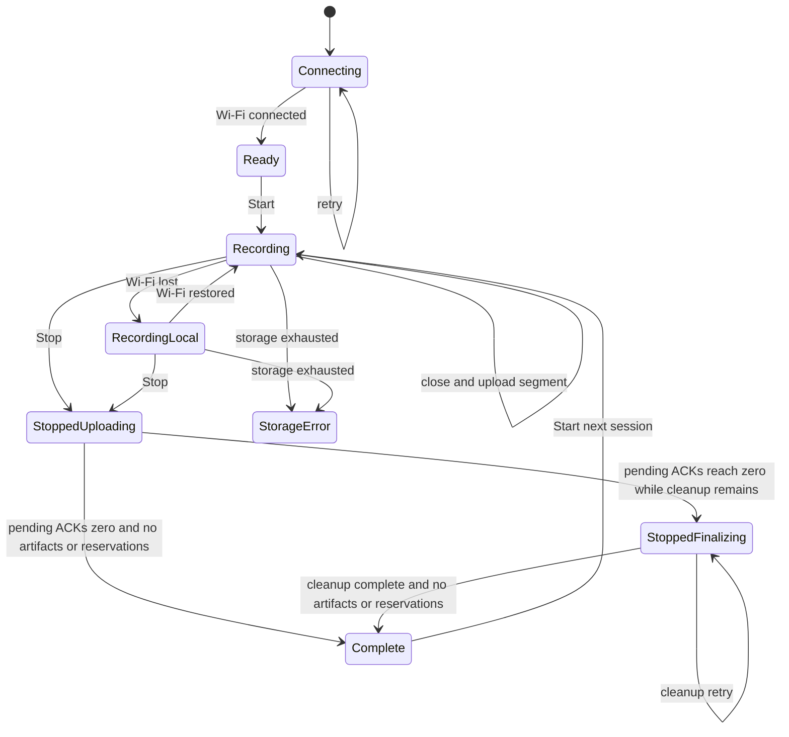

# ESP32 Device-to-Cloud Audio Demo Design

> **Status:** v1 · Partially implemented
> **Date:** 2026-07-15
> **Role:** This document describes how the agreed demo contract in
> [spec.md](spec.md) is or will be implemented. It does not redefine that
> contract. Proposed changes are agreed first in [idea.md](idea.md), promoted
> into the spec, and only then reflected here.

This design is intentionally small. It describes one board, one audio format,
one upload protocol, one uploader worker, and one filesystem-backed receiver.
It is not a production-cloud design.

## Status vocabulary

| Label | Meaning |
| --- | --- |
| **Required design** | Behavior required by the agreed spec, whether or not the current code provides it. |
| **Implemented** | Present in the current source and covered by compilation, static inspection, or receiver tests. |
| **Partial** | Supporting code exists, but the complete required behavior is missing. |
| **Unverified** | Correctness depends on running the physical board and has no recorded acceptance evidence yet. |

`Implemented / Unverified` is a permitted handoff status for software-complete
work when every gate that was run passes and every unrun applicable gate is
named. Partial work remains `Partial / Unverified` as applicable. Neither is a
`Verified` or `Complete` claim.

## 1. Demo guardrails and principles

1. Audio capture between Start and Stop is the highest-priority behavior.
2. Only a closed WAV segment may cross the network boundary.
3. Upload failures are isolated from capture while local storage remains.
4. An acknowledged segment may be deleted; an unacknowledged closed segment
   may not be silently deleted or overwritten.
5. The simplest path that proves the contract wins. There is no WebSocket
   transport, codec, playback path, database, Redis, account system,
   dashboard, distributed queue, or production platform.
6. Build and unit-test success are software evidence, not physical-demo
   acceptance.

The only supported device is the ESP32-S3-Touch-AMOLED-1.75C. The fixed first
proof format is 16 kHz, 16-bit, two-channel PCM in WAV containers, divided into
nominal 10-second segments. Any future format, codec, DSP, or duration change
must first satisfy the gates in the spec.

## 2. End-to-end architecture

```mermaid
flowchart LR
    U["User: Start / Stop"] --> UI["Device UI state"]
    MIC["Board microphone + I2S"] --> CAP["High-priority capture task"]
    UI --> CAP
    CAP --> ACTIVE["Active WAV on SPIFFS"]
    ACTIVE -->|"close header + metadata"| CLOSED["Durable closed segment"]
    CLOSED --> Q["Sequential uploader"]
    Q -->|"HTTP POST over Wi-Fi"| API["Minimal FastAPI receiver"]
    API --> VAL["Token, checksum, WAV, metadata validation"]
    VAL --> STORE["Run directory on local filesystem"]
    STORE -->|"matching SEGMENT_ACK"| Q
    Q -->|"after ACK: delete WAV, then metadata"| CLOSED
```



While the uploader handles segment *N*, the capture task writes segment
*N + 1*. The active file is never put on the upload queue. The receiver returns
a normal JSON acknowledgment only after it has accepted the complete WAV and
written its artifacts.

### Required topology

| Boundary | Choice |
| --- | --- |
| Device | One ESP32-S3-Touch-AMOLED-1.75C |
| Network | Device joins one preconfigured Wi-Fi network in STA/client mode |
| Transport | Sequential HTTP POST of closed WAV files |
| Demo endpoint | `http://192.168.15.195:8000/v1/device/audio-segments` on the same LAN |
| Receiver | One FastAPI process for one demo device |
| Persistence | SPIFFS on device; ordinary files on receiver |

## 3. Device UI state machine

### Required design



The user-facing text is limited to:

- `Connecting to Wi-Fi`, `Ready`, and Wi-Fi `Connected` or `Offline` status;
- `Recording` or `Recording · uploading segment N`;
- `Wi-Fi lost · recording locally` without ending capture;
- `Stopped · uploading N` while one or more matching ACKs remain;
- `Stopped · finalizing` after all matching ACKs arrive but artifacts or
  upload/cleanup reservations remain; and
- `Complete · N segments uploaded` only after every matching acknowledgment,
  successful local cleanup, and clearance of every segment artifact and
  upload/cleanup reservation.

`Upload error` is an orthogonal, nonterminal indicator layered on the current
lifecycle state after a retryable upload or acknowledgment failure. It remains
visible for the affected segment until that segment receives its matching ACK;
it does not itself enter or leave Recording, stopped, or Complete states.

`RecordingLocal` is entered only after Wi-Fi connectivity is lost. An upload
delay while Wi-Fi remains connected leaves the lifecycle in `Recording` and is
represented by the current upload/pending counts; a retryable upload or
acknowledgment failure additionally raises the orthogonal `Upload error`
indicator under E9.

Start is enabled only when Wi-Fi is connected and no previous session has
pending artifacts or reservations. A zero pending count is only an upload
backlog observation; it is not Complete until the distinct cleanup event and
artifact/reservation checks pass. Stop is enabled only during capture. Display
sleep is a presentation-only transition: it must not change capture, upload,
session, or button state. During recording, a double-tap wakes the display
without issuing Start or Stop.

### Current implementation

**Partial.** The LVGL interface has only Start and Stop, shows a Recording
duration, and retains the 10-second display sleep plus double-tap wake behavior.
It does not expose Wi-Fi state or uploaded/pending counts. It enters `Ready`
before deferred Wi-Fi startup, enables Start without checking connectivity, and
returns its internal state to `Ready` as soon as Stop finalizes the active
file. It therefore lacks the required `Stopped · uploading N`, `Stopped ·
finalizing`, and `Complete · N segments uploaded` progression. Uploader
failures are logged and counted but never reported to LVGL, and LVGL does not
yet consume the lifecycle cleanup event, so the required orthogonal `Upload
error` presentation and G7/G9 completion gate are also missing.

## 4. Audio capture and segment lifecycle

### Required lifecycle

1. Start creates a unique run ID, resets the run's segment index to 1, and
   opens a WAV with a placeholder 44-byte header.
2. The I2S task continuously drains the microphone. During the session, a
   buffer becomes admitted only when its recorder write acquires the
   recorder/session lock; outside the session, drained PCM is discarded.
3. At the fixed segment boundary, the device rewrites the WAV header, flushes
   and closes the file, persists its upload metadata, and makes it eligible for
   upload.
4. The next segment opens immediately and receives the next sample exactly
   once. Word boundaries do not affect segmentation.
5. Stop takes the same recorder/session lock. A buffer whose recorder write
   acquired it first may finish, including any rotation it triggers. Once Stop
   acquires the lock, no later buffer is admitted; it finalizes admitted PCM as
   a nonempty final partial segment when any exists, otherwise removes the
   zero-data placeholder, marks the recorder inactive, and then releases the
   lock. A buffer already read from I2S but not admitted, and all later buffers,
   is discarded and is never persisted or transmitted. The I2S task may
   continue draining in this discard-only mode while uploads finish.

### Current implementation

The capture task reads 1,024 stereo PCM frames per I2S call at priority 7,
including while no recording session is active. Its acquisition of the
recorder/session mutex inside the recorder write is the exact PCM-admission
boundary; a Stop that acquires that mutex first makes the later write reject
the buffer without persistence. The segment recorder writes admitted buffers
to SPIFFS and rotates after accumulated PCM reaches the configured threshold of
`CONFIG_AUDIO_SEGMENT_SECONDS * 64,000` bytes. Each admitted buffer is 1,024
stereo PCM frames, or 4,096 bytes and 64 ms. At the required 10.000-second
target, 156 buffers contain 638,976 bytes and 9.984 seconds, so rotation occurs
after buffer 157 at 643,072 PCM bytes and 10.048 seconds. The overshoot is less
than one buffer; no admitted buffer is intentionally split, repeated, or
discarded. Metadata preserves the actual byte-derived duration, while
`segment_start_ms` remains the nominal index-derived offset. The next segment
index is opened after the previous header and metadata are finalized.

The current local artifacts are:

```text
<SPIFFS mount>/segment_000001.wav
<SPIFFS mount>/segment_000001.meta.json
<SPIFFS mount>/segment_000001.meta.json.tmp  # only during an interrupted metadata commit
```

The active WAV is outside the durability promise and never upload-eligible.
Only after closing and syncing the WAV and successfully committing its complete
canonical metadata does the segment enter the durable closed set. The recorder
writes new metadata to the temporary path, flushes and syncs it, parses it
back, validates it against the
finalized WAV, and promotes it only when the canonical sidecar does not exist.
If Stop finds that no PCM buffer was admitted, the zero-data placeholder is
removed; it is not a finalized segment and does not increment finalized or
pending evidence counts.
Canonical metadata is a write-once snapshot: retry counters advance only in
RAM and the HTTP headers, so retries never truncate, delete, or replace the
sidecar. The metadata records run ID, index, nominal start time, byte count,
duration, gap/overflow counters, and its initial retry count.

A short-held storage mutex protects active-path and upload-path reservations.
The recorder mutex is acquired before the storage mutex when both are needed;
the storage mutex is not held during PCM writes, WAV/metadata syncing and
validation, hashing, Wi-Fi waits, or HTTP. Start rejects with
`ESP_ERR_INVALID_STATE` while any segment WAV, canonical or temporary sidecar,
or upload reservation remains. Segment filenames are index-only and the index
resets for each accepted Start, but this gate prevents reuse while an earlier
session still owns the namespace.

For physical timing and queue evidence, current-run lifecycle records begin
with these stable fields:

```text
segment_event=finalized event_monotonic_ms=<n> run_id=<id> segment_index=<n> finalized_count=<n> acked_count=<n> pending_count=<n> duration_ms=<n> data_bytes=<n>
segment_event=acked event_monotonic_ms=<n> run_id=<id> segment_index=<n> finalized_count=<n> acked_count=<n> pending_count=<n> cleanup_complete=false
segment_event=segment_cleanup_complete event_monotonic_ms=<n> run_id=<id> segment_index=<n>
session_event=stop_boundary event_monotonic_ms=<n> run_id=<id> session_duration_ms=<n>
session_event=stopped stop_monotonic_ms=<n> run_id=<id> session_duration_ms=<n> ...
```

The explicit monotonic fields, captured from the same device clock, are the
normative event times; ESP-IDF log prefixes provide a corroborating trace. The
Stop-boundary record is emitted after Stop acquires the recorder/session lock
and before finalization. Structured counts are emitted only for finalized and
matching-ACK events from the current run, with
`pending_count = finalized_count - acked_count`; recovery ACKs from an older
run do not mutate those counters. The cleanup record is emitted only after the
WAV and sidecars are gone and the upload reservation is released. Consequently
an ACK may make `pending_count` zero while `cleanup_complete=false`; that is not
a Complete transition. `session_duration_ms` measures from immediately after
the first WAV opens successfully through the instant Stop acquires the
recorder/session lock, before final-partial finalization.

The lifecycle is **implemented in source**, including the exact Stop boundary,
final-partial closure, and evidence records, but boundary continuity, audio
quality, end-to-end duration agreement, filesystem durability, and concurrent
Wi-Fi behavior remain **unverified on hardware**. The buffer-aligned full-file
duration is deterministic in source, but because header rewrite and rotation still
execute in the capture task, the physical no-gap test is deciding evidence.

## 5. Wi-Fi and sequential uploader

### Required design

- ESP-IDF initializes one STA/client interface and automatically joins the
  configured network.
- Recording has priority over networking. A transient disconnect leaves closed
  segments on SPIFFS and does not end the session.
- One worker uploads one segment at a time. After every queue wake or timeout,
  it scans durable storage and selects the lowest pending segment index; the
  queue is only a wake hint and never authorizes a later identity to overtake
  that filesystem candidate. Normal Wi-Fi is the
  deterministic condition in which the configured fixed same-LAN receiver is
  continuously reachable, no impairment is intentionally induced, and the run
  begins with zero pending segment WAVs, sidecars, temporary sidecars, or
  upload/cleanup reservations. Under that condition, each full segment must
  receive its matching ACK less than 10 seconds after finalization.
- A failed request keeps the original WAV and metadata, waits briefly, and
  retries. The active segment is never considered by the worker.
- After reboot, the worker resumes closed segments described by durable
  metadata.

### Current implementation

`wifi_manager` uses `WIFI_MODE_STA` and ESP-IDF Wi-Fi/IP events. Disconnects
schedule reconnect attempts with exponential delays from 1 to 30 seconds. The
application starts networking in a deferred priority-3 task after the UI is
already Ready, so required Start gating and connection presentation are still
missing.

The uploader is one priority-3 task with an eight-entry in-memory queue used
only as a wake hint. It waits up to 15 seconds for Wi-Fi, uses a 30-second HTTP
timeout, and waits 5 seconds after a failed attempt. After either a queue
receive or a one-second timeout, the worker scans the union of WAV, canonical
metadata, and temporary-metadata names and selects the lowest pending index.
Queue overflow is nonfatal because the durable filesystem scan remains
authoritative; a later queued identity never bypasses an earlier durable one.

Before hashing or transport, the filesystem-selected candidate path reserves
the WAV name, rejects an active-path conflict, requires parseable canonical
metadata, and verifies a finalized PCM header, block-aligned data length, and
exact `44 + data_bytes` file size. A valid temporary sidecar is promoted only
when canonical metadata is absent and the WAV passes the same validation.
Invalid or ambiguous combinations are retained and reported rather than
deleted. The scan continues to select that lowest problematic index, blocking
higher indexes as well as a new Start until the problem is resolved.

The closed-file and retry paths are **implemented in source**. The finalized
and ACK lifecycle records provide the timestamp source for E8, but physical
proof that no active WAV is posted, every full-segment finalize-to-ACK interval
is below 10 seconds on deterministic normal Wi-Fi, live ordering and throughput
during disconnect recovery, reboot recovery, and absence of capture gaps remain
**unverified**. The lowest-index selection rule itself is implemented in source.
F1, F3, and F5 remain partial for the independent filesystem risks in Section
8.

## 6. HTTP request and acknowledgment contract

The device sends one request for each fully closed segment:

```http
POST /v1/device/audio-segments HTTP/1.1
Content-Type: audio/wav
X-Device-Id: <configured device id>
X-Run-Id: <run id>
X-Segment-Index: <positive decimal index>
X-Segment-Start-Ms: <device uint64 start offset in decimal milliseconds>
X-Sample-Rate: 16000
X-Channels: 2
X-Bits-Per-Sample: 16
X-Content-Sha256: <lowercase SHA-256 of complete WAV body>
X-Device-Local-Gap-Count: <non-negative decimal count>
X-Device-Storage-Overflow-Count: <non-negative decimal count>
X-Upload-Retry-Count: <non-negative decimal count>
X-Collection-Token: <locally configured demo token>

<complete WAV bytes>
```

All listed headers are part of the device demo contract. The receiver parser
allows the three device counters to be absent for diagnostic compatibility,
but a run with missing proof counters does not pass its summary. The collection
token is operationally required.

The receiver accepts the request only after it verifies:

- the collection token;
- a nonempty run ID whose UTF-8 encoding is at most 95 bytes;
- a positive segment index and non-negative supplied counters;
- SHA-256 equality;
- a readable, non-empty PCM WAV; and
- equality between WAV and header sample rate, channel count, and bit depth.

Device requests always send a non-negative start offset because the firmware
stores it as `uint64_t`. The receiver currently parses that header as a Python
integer but does not separately reject a negative value from another client;
that validation edge remains a small receiver gap.

A successful or same-checksum duplicate request returns HTTP 2xx with a JSON
object containing at least:

```json
{
  "type": "SEGMENT_ACK",
  "run_id": "<same run id>",
  "segment_index": 1,
  "sha256": "<same WAV SHA-256>"
}
```

The device treats the response as an acknowledgment only when all four fields
match the upload. It deletes the WAV first and then its sidecars. If local
cleanup fails, the upload reservation remains and cleanup retries without
another POST; another Start stays blocked until cleanup finishes. A non-2xx
response, missing body, malformed JSON, or mismatch is a retryable failure and
leaves the original WAV and canonical metadata intact.

The receiver returns 401 for a missing request token, 503 when its own
`CLOUD_COLLECTION_TOKEN` is absent or blank, 403 for a configured-token
mismatch, 400 for invalid checksum/WAV/metadata consistency, 409 when the same
run/index already exists with different audio, and validation errors for
invalid headers. Empty or overlength run IDs also return 400. Token and
request-validation failures create no receiver artifacts. A
different-checksum conflict does update `.summary_state.json` and `summary.json`
diagnostics before returning 409, but it neither replaces the accepted WAV nor
creates a duplicate WAV or per-segment summary. A retry with the same run,
index, and checksum is idempotent.

## 7. Minimal FastAPI receiver

The FastAPI application contains one relevant route and writes ordinary files.
With the default output directory, a run is laid out as:

```text
device-audio-segments/
└── <run-directory>/
    ├── segment_000001.wav
    ├── segment_000001.summary.json
    ├── segment_000002.wav
    ├── segment_000002.summary.json
    ├── summary.json
    └── .summary_state.json  (created only after a checksum conflict)
```

`CLOUD_AUDIO_SEGMENT_DIR` changes the root. Directory mapping is injective and
safe for traversal and case-insensitive filesystems:

- a lowercase canonical ID matching `[a-z0-9][a-z0-9_.-]{0,94}` is preserved
  verbatim;
- every other accepted ID maps to `~` followed by the lowercase hexadecimal
  form of its exact UTF-8 bytes, so `a/b` becomes `~612f62`, `a?b` becomes
  `~613f62`, and `..` becomes `~2e2e`.

The canonical and encoded namespaces are disjoint because `~` is not a
canonical first character. The exact original run ID remains in ACKs and JSON
metadata. Per-segment summaries preserve identity, format, index, nominal
start, duration, checksum, sizes, and device counters. `summary.json` derives
received indexes, missing/duplicate/checksum counts, total received duration,
counter maxima, and proof-failure reasons. When a conflicting duplicate is
seen, `.summary_state.json` is created as the small internal checksum-conflict
counter; it is absent from an ordinary successful run.

Legacy directories created by the earlier lossy mapping are left untouched;
new acceptance runs use a clean receiver root. No migration layer is added
within the I8 manual-retention scope. Receiver tests cover canonical
compatibility, alias separation, `.`/`..` containment, case-distinct IDs,
exact metadata identity, and empty/overlength rejection. This receiver-side
namespace fix does not resolve the firmware's reboot-unsafe H2 run identity.

The receiver does not concatenate, play, transcribe, analyze, retain by policy,
or expose a dashboard. Manual inspection and deletion are sufficient for this
demo.

## 8. Failure, retry, reboot, and storage behavior

| Event | Required behavior | Current status |
| --- | --- | --- |
| Brief Wi-Fi loss | Keep recording; retain and later drain closed segments. | Retry path implemented; physical K8 test unverified. |
| HTTP or ACK failure | Preserve WAV/metadata and retry sequentially. | Implemented with a 5-second retry delay; canonical metadata is not rewritten. Physical failure testing is unverified. |
| Upload queue full | Preserve closed data for the authoritative lowest-index filesystem scan. | Implemented; the queue is only a wake hint, the overflow counter is incremented, and the overflow event is logged. |
| Finalized segment awaiting ACK/cleanup | Retain its WAV and complete metadata until a matching ACK; then retry acknowledgment-driven cleanup until every artifact and reservation is gone. | **Partial / Unverified (F1).** Source retention and cleanup gating exist, but filesystem/power-loss behavior and board evidence are incomplete. |
| Matching ACK | Delete the acknowledged WAV and sidecars to release storage, then release the reservation. | **Implemented (F2).** WAV-first cleanup retries without another POST if any deletion fails. |
| Reboot with closed segments | Resume from persisted metadata after Wi-Fi returns. | **Partial / Unverified.** Canonical recovery and valid temporary-sidecar promotion exist, but physical reboot is unverified and filesystem-wide power-loss corruption recovery is unresolved. |
| Power loss with active segment | Recovery is not required for this demo. | The active WAV is outside closed-segment durability, has no finalized metadata, and is never uploaded as-is. |
| Storage reserve exhausted | Stop capture and show a visible error; never reduce quality or delete audio. | **Partial.** The 64 KB reserve and visible `Storage error` exist, but the current abort path removes the unfinished active WAV; physical behavior is unverified. |
| Stop with pending files | End session recording at the F8 lock boundary; continue discard-only I2S draining and pending uploads; show stopped until the G7 cleanup gate passes. | Recorder boundary/upload continuation implemented; UI progression missing. |

### F7 outage storage budget

F7 requires capacity for at least 60 seconds of new audio while upload is
unavailable, without treating the raw partition label as proof of usable
space. The conservative budget is:

| Component | Bytes | Basis |
| --- | ---: | --- |
| Buffer-rounded 60-second outage | 3,842,048 | 938 capture buffers × 4,096 bytes; `ceil(60 / 0.064)` |
| One active full segment | 643,072 | 157 capture buffers |
| One conservative catch-up window | 643,072 | One additional full segment while backlog drains |
| Eight WAV headers | 352 | 8 × 44 bytes |
| Eight bounded metadata sidecars | 16,384 | 8 × the 2,048-byte validation bound |
| Free-space reserve | 65,536 | Existing 64 KiB capture reserve |
| **Required usable free space** | **5,210,464** | Approximately 5.21 MB |

The configured raw storage partition is 7 MiB, or 7,340,032 bytes, leaving
2,129,568 raw bytes above this estimate. SPIFFS overhead, prior artifacts, and
unusable blocks mean that raw size alone is not proof. Before K8, the boot
record must report `total - used >= 5,210,464` from `esp_spiffs_info`, with zero
pre-existing segment artifacts or reservations. K8 remains the deciding live
capacity/catch-up test. F7 is therefore **Partial / Unverified** until that
boot report and the hardware outage run pass.

### Session and storage safety

Local filenames use only the segment index and reset to 1 for every run. The UI
still presents Start before it can display the required Complete state, but the
recorder now rejects that command while any recognized WAV, canonical or
temporary metadata, or upload/cleanup reservation remains. Once ACK cleanup
has removed every artifact, a later Start may reuse index 1. This provides the
required second-session namespace gate in source without another persistence
service. Its physical behavior, including rejection during transport and local
cleanup followed by a successful later Start, remains unverified for G9.

The current run ID combines the configured device ID with boot-relative timer
time. It distinguishes normal Starts within one boot, but it does not guarantee
uniqueness across reboots. H2 therefore remains partial until the demo uses a
reboot-safe unique value.

An unfinished active WAV after sudden power loss is intentionally outside
recovery scope and may require manual demo reset. A canonical sidecar with no
WAV, a WAV with no recoverable sidecar, canonical and temporary sidecars
together, or malformed metadata is ambiguous. The worker preserves and reports
such combinations rather than guessing, and Start remains blocked for manual
recovery. Startup mounts SPIFFS with `format_if_mount_failed = false`; a mount
failure preserves the partition, halts recording startup, and is surfaced as a
visible startup error. Filesystem-wide corruption after power loss is not
otherwise recovered. These residual risks and missing physical recovery
evidence keep F3 and F5 partial, and prevent a complete F1 durability claim
until filesystem and board evidence proves pre-ACK retention and the required
cleanup gate. F2's
acknowledgment-driven deletion path is implemented independently of those
remaining durability claims.

The build defines an explicit `idf.py storage-flash` target that generates and
writes an empty SPIFFS image. It intentionally omits `FLASH_IN_PROJECT`, so
ordinary `idf.py flash` does not touch the storage partition. `storage-flash`
is a destructive, operator-only first-provision/reset action and is permitted
only when no pending audio must survive. Because it can destroy finalized
audio, it is behavioral work traced to F1/F3/F5 and must be recorded in the
verification evidence; it is not exempt as tooling-only work.

## 9. Task priorities and concurrency

| Work | Current task | Priority | Role |
| --- | --- | ---: | --- |
| I2S read and segment write/rotation | `audio_capture` | 7 | Highest application-controlled priority; drains I2S and feeds the recorder. |
| Rendering, timers, and touch dispatch | `lvgl` | 6 | ESP LVGL adapter worker. |
| Start command and recorder initialization | `app_cmd` | 4 | Keeps storage setup out of the LVGL click callback. |
| Sequential upload | `seg_upload` | 3 | Hashes and sends closed WAVs only. |
| Application network orchestration | `defer_net`, `wifi_retry` | 3 | Starts Wi-Fi/recovery and schedules reconnect attempts. |

These are application-created or application-configured tasks; the ordering
does not describe or constrain ESP-IDF's internal Wi-Fi, TCP/IP, or system-task
priorities. The listed tasks are not core-pinned. A recorder mutex protects
active-file state and statistics. A storage mutex protects only namespace
checks and active/upload path reservations; the fixed order when both are
required is recorder mutex, then storage mutex. The uploader reserves and
revalidates a candidate before it reads the WAV, so an active path cannot
become upload-eligible during hashing or transport. The storage mutex is not
held during PCM writes, filesystem syncing/validation, hashing, Wi-Fi waits,
or HTTP.

Storage, the audio codec/I2S path, and the capture task are initialized before
the deferred network task can start Wi-Fi or pending uploads. Within the
recorder, its mutexes, storage mutex, and wake queue are created before the
uploader task. These startup dependencies and the task table make B5's
application-controlled priority mechanically inspectable.

B5 nevertheless remains **Partial / Unverified** until a live loaded run shows
all four objective outcomes: the listed priority ordering remains in effect;
capture and recorder resources initialize before uploader startup; there are
zero I2S read, recorder write, and capture-resource allocation failures; and
the terminal same-run `local_gap_count` and `storage_overflow_count` are both
zero. Heap diagnostic logs are supporting context, not a substitute for those
pass conditions or an additional arbitrary threshold. Filesystem rotation
still occurs in the capture task, so K4/K5 boundary and concurrency evidence is
deciding.

## 10. Configuration and secret boundaries

Device values come from ESP-IDF **Project Runtime Configuration** and are kept
in local, Git-ignored `sdkconfig`:

| Kconfig symbol | Purpose |
| --- | --- |
| `CONFIG_WIFI_MANAGER_SSID` | One station SSID |
| `CONFIG_WIFI_MANAGER_PASSWORD` | Station password |
| `CONFIG_RUNTIME_CONFIG_CLOUD_AUDIO_SEGMENT_URL` | Segment POST URL |
| `CONFIG_RUNTIME_CONFIG_DEVICE_ID` | Non-secret device identity |
| `CONFIG_RUNTIME_CONFIG_COLLECTION_TOKEN` | Shared demo collection token |
| `CONFIG_AUDIO_SEGMENT_SECONDS` | Fixed nominal whole-buffer-aligned segment target; agreed default 10 seconds |

Upload is enabled only when SSID, password, endpoint, and token are all present.
The current same-LAN URL is configuration, not a second protocol. Public
Internet use would require HTTPS and is outside this same-LAN acceptance setup.

The receiver requires a nonblank `CLOUD_COLLECTION_TOKEN` matching the device
token and reads the optional `CLOUD_AUDIO_SEGMENT_DIR` environment variable.
It fails closed with HTTP 503 before artifact creation when its token setting
is absent or blank. No real password or token value belongs in source, tracked
defaults, documentation, test output, responses, or logs. Logs may contain
non-secret device/run IDs, segment indexes, counters, and artifact paths.

Receiver token enforcement for I4 is implemented and covered by tests.
**Remaining I3 gap:** `wifi_manager` logs the configured SSID after station
startup. Because the spec treats Wi-Fi credentials as non-loggable, that value
must be removed or redacted before I3 is complete.

## 11. Verification strategy

### Software gates

| Scope | Gate | What it establishes |
| --- | --- | --- |
| Documentation | Relative links/Markdown inspection and `git diff --check` | Document integrity only. |
| Receiver | `python -m pytest -q cloud/tests` | Valid upload, ACK, artifacts, idempotence, gaps, counters, validation/token rejection without artifacts, different-checksum 409 diagnostics, and injective/path-safe run-ID mapping with exact identity preservation and length rejection. |
| Firmware | `idf.py build` in an activated ESP-IDF environment | Source/configuration compile; no hardware behavior. |

### Physical proof

The quick smoke run records about 65 seconds and should produce six nominal
full segments plus one partial. It is a setup check, not the entire proof. The
primary normal-Wi-Fi run covers K1-K7 plus K9. A separate secondary outage run
covers K8, and targeted checks supply any A1-J5 evidence not established by
those runs. Neither run alone completes the demo.

Evidence should include the run ID, receiver `summary.json`, ordered WAV files,
timestamped device lifecycle records, observed UI counts and states, timing,
and the listening result. Store evidence outside tracked source or in an
ignored local location, and sanitize credentials before sharing it. In
particular, logs containing the currently exposed SSID cannot serve as final
I3-compliant evidence until that gap is fixed.

Normal-Wi-Fi checks use the configured fixed same-LAN receiver while it remains
continuously reachable, with no intentionally induced impairment and zero
pending segment WAVs, sidecars, temporary sidecars, or upload/cleanup
reservations at run start. Use these reproducible procedures:

| Check | Procedure and pass condition |
| --- | --- |
| B5 | Inspect the live task list and startup log: capture priority is strictly above every application-controlled display, command, network-orchestration, and upload task, and I2S/recorder/buffer/task resources initialize before uploader startup. During concurrent display, rotation, and upload load, observe no I2S read, recorder write, or capture-resource allocation failure. The terminal same-run metadata/summary must report `local_gap_count == 0` and `storage_overflow_count == 0`; repeat the K4 and K5 checks under that load. |
| E8 | For each nominal full segment in the normal-Wi-Fi run, pair the same-run/index `segment_event=finalized` and `segment_event=acked` records. Subtract their `event_monotonic_ms` values; every finalize-to-matching-ACK interval is less than 10 seconds. |
| G5 / E9 | While Wi-Fi remains connected and capture continues, force one retryable HTTP or mismatched-ACK failure for a known segment. Its WAV and canonical sidecar remain, its pending count stays nonzero, and `Upload error` appears without leaving the current lifecycle state. The indicator remains through retries and clears only when that same segment receives its matching ACK. The current UI is expected to fail until the deferred UI phase. |
| F7 | Before K8, use the boot `esp_spiffs_info` record to verify usable free space is at least 5,210,464 bytes and inspect that no segment artifacts or reservations pre-exist. Raw partition size is not a pass condition; K8 is the deciding live capacity test. |
| K1 | In the primary run, the same-run `session_event=stop_boundary` reports `session_duration_ms >= 120000`, with no intervening session stop or restart. |
| K2 | Read terminal `finalized=T` from the same-run `session_event=stopped` record and require `T >= 1`. Same-run `segment_event=finalized` records must contain each index `1..T` exactly once. Receiver WAVs, per-segment summaries, and `summary.json` must independently describe exactly `1..T`, with matching received count, first/last indexes, and zero missing or duplicate indexes. |
| K3 | Read `session_duration_ms` from the same-run `session_event=stop_boundary` record. Sum each receiver WAV's PCM duration as `frame_count / sample_rate * 1000`; the absolute difference from the device monotonic duration must be at most 1,000 ms. The device interval starts immediately after the first WAV opens successfully and ends when Stop acquires the recorder/session lock. |
| K4 | Play receiver WAVs in index order without crossfade, inserted silence, or overlap. Listen across every adjacent boundary and record the listener, run ID, boundary pair, and result; every boundary must have no obvious gap, corruption, or repeated audio. |
| K5 | Before the Stop boundary, require at least one same-run matching `segment_event=acked` while recorder and UI evidence both remain Recording, with no stop or error transition. Repeat while display and upload work are concurrent for B5. |
| K6 | Filter current-run finalize/ACK records and verify each structured `pending_count` equals `finalized_count - acked_count`. It never exceeds 2, and the ACK event that returns it to zero has `event_monotonic_ms` no more than 15,000 ms after the same-run `session_event=stop_boundary` value. Receiver summary update times and the post-finalization `session_event=stopped` log prefix are not the event-time source. |
| K7 | On normal Wi-Fi, press Stop after at least one buffer has entered a new segment and before its full boundary. For that nonempty final partial, subtract the same-run Stop-boundary `event_monotonic_ms` from the matching ACK event value; the result is no more than 15,000 ms. |
| K8 | Before the secondary Start, inspect the device and confirm no pending WAV, canonical or temporary sidecar, or upload/cleanup reservation remains. While recording, wait for the same-run event counts to show `pending_count == 0`, disconnect Wi-Fi for 60 continuous seconds, and verify recording continues. After reconnection, the same formula must reach zero within 60 seconds while capture is still active. Record disconnect/reconnect times, every pending transition, drain time, ordered receiver artifacts, and the boundary-continuity result. |
| K9 | During the primary run, let the screen sleep, double-tap once, and verify no Start or Stop action occurs. After the 200 ms UI refresh, the awake screen must still show Recording and counts equal the latest same-run structured uploaded/pending counts. |

At 64 KB/s of real-time PCM production, K8 requires roughly **128 KB/s before
protocol overhead**, about **2× real time**, to clear a 60-second backlog while
another 60 seconds is recorded. This catch-up test is intentionally stronger
than E8's unimpeded per-segment close-to-ACK limit.

Targeted storage-safety evidence must also show that an active WAV is never
posted; Start is rejected while upload or ACK cleanup owns the namespace and
succeeds after cleanup; HTTP failure preserves the WAV and canonical sidecar;
a reboot resumes a closed segment; and a valid temporary sidecar is promoted.
On an erased board, explicitly run `idf.py storage-flash` once and confirm the
empty filesystem mounts. Then create a pending finalized segment, run ordinary
`idf.py flash`, reboot, and verify that the storage survives and recovery
uploads it. Separately inject a mount failure without running the destructive
target; require the visible startup error and compare the storage partition
before and after to prove it was unchanged.

After raising capture to priority 7, inspect the live application task
priorities and repeat K4, K5, and K9 under concurrent display and upload load.
For G7/G9, physically Stop with work pending and require `Stopped · uploading
N` while ACKs remain. When an ACK reduces `pending_count` to zero but artifacts
or a reservation remain, require `Stopped · finalizing`, not Complete. Only
after the matching `segment_event=segment_cleanup_complete` and an empty
artifact/reservation inspection may `Complete · N segments uploaded` and Start
become available. Finally start the next session successfully. The current UI
cannot yet pass this check because its uploading/finalizing/Complete, count,
and Start-gating progression remains partial.

K1-K9 are necessary but are not sufficient by themselves. No software-only
result can mark the demo Complete: every A1-J5 requirement needs its applicable
evidence and every K1-K9 condition needs physical-board evidence.

## 12. Current implementation status and known gaps

| Area | Status | Evidence or gap |
| --- | --- | --- |
| Board, display, microphone/I2S, SPIFFS initialization | **Implemented / Unverified** | Current source builds under ESP-IDF 6.0; capture quality and runtime behavior still require the board. |
| PCM WAV creation, Stop boundary, and nominal 10-second rotation | **Implemented / Unverified** | Whole-buffer rotation deterministically closes full segments at 10.048 seconds/643,072 PCM bytes and records actual duration; boundary quality is untested physically. |
| STA Wi-Fi and reconnect | **Implemented / Partial** | Event-driven connection exists; UI starts Ready before connection and Start is not gated. |
| Capture priority / B5 | **Partial / Unverified** | Source ordering and initialization dependencies are defined; zero I2S/write/allocation failures and zero terminal gap/overflow counters under live concurrent load are not proven. |
| Sequential upload and closed-file isolation | **Implemented / Unverified** | One worker treats the eight-entry queue only as a wake hint and authoritatively scans the filesystem's lowest pending index through strict validation, reservations, ACK matching, and cleanup; live ordering and active-file exclusion need physical proof. |
| Finalized retention / F1 | **Partial / Unverified** | Closed-only source retention and cleanup gating exist; filesystem/power-loss behavior and physical pre-ACK retention evidence remain incomplete. |
| ACK-driven deletion / F2 | **Implemented** | Matching ACK invokes WAV-first sidecar cleanup; deletion retries without reposting and releases the reservation only after success. |
| Retry metadata and interrupted commit recovery | **Implemented / Unverified** | Canonical metadata is write-once, retries update RAM/headers, and a valid temporary sidecar can be promoted; failure/reboot behavior needs physical proof. |
| Reboot/no-discard durability / F3/F5 | **Partial / Unverified** | Scanning/recovery and non-formatting mount failure exist, but filesystem-wide power-loss corruption recovery and physical reboot/preservation evidence remain incomplete. |
| Sixty-second outage capacity / F7 | **Partial / Unverified** | The 5,210,464-byte usable-free-space budget fits below the 7 MiB raw partition, but boot-reported usable space and the K8 hardware outage/catch-up run are required. |
| Lifecycle evidence | **Implemented / Unverified** | Current-run finalize/ACK counts, distinct cleanup, and monotonic Stop-duration records exist; no complete physical log set is recorded. |
| Minimal receiver | **Implemented** | Route, fail-closed token validation, idempotence, artifacts, summaries, conflict handling, and the injective/path-safe run-directory mapping with exact identity and length checks are receiver-tested. |
| Start/Stop-only interface | **Implemented** | No Play or local playback path remains. |
| Wi-Fi status and upload counts | **Partial** | Recorder counters exist, but the UI does not show Wi-Fi, uploaded, or pending values. |
| Upload error status | **Partial** | The uploader retries and counts failures, but the UI receives no failure status. |
| Post-Stop progression / G6/G7 | **Partial** | Session recording stops at the lock boundary and uploads/cleanup continue, but the UI returns to Ready without `Stopped · uploading N`, `Stopped · finalizing`, cleanup-gated Complete, or a physical G7 check. |
| Second-session storage safety / G9 | **Partial / Unverified** | The recorder rejects Start until all artifacts/reservations clear, but the UI still enables it early and no physical rejection/cleanup/restart evidence is recorded. |
| Firmware run identity / H2 | **Partial** | The boot-relative run ID distinguishes Starts within one boot but is not guaranteed unique across reboot. |
| Receiver run namespace / H3 | **Implemented** | Canonical lowercase IDs remain compatible; every other accepted exact UTF-8 ID has a disjoint hex directory, with alias/path/case tests. |
| Completion UI | **Partial** | The UI still lacks pending/finalizing/Complete progression and cleanup-driven Start gating. |
| Configuration and secret handling | **Partial** | Receiver token enforcement fails closed and local `sdkconfig` is ignored, but the configured SSID is currently logged. |
| Display sleep and double-tap wake | **Implemented / Unverified** | Code preserves session state, but K9 has no physical evidence. |
| A1-J5 plus K1-K9 completion gate | **Partial / Unverified** | Normative gaps remain and no complete physical-board K evidence set is recorded; the demo must not be declared complete. |

## 13. Key tradeoffs

| Choice | Demo benefit | Accepted cost |
| --- | --- | --- |
| HTTP files instead of WebSockets | Playable artifacts, simple retries and debugging | Roughly one request every 10 seconds, not sample-level live latency |
| Uncompressed WAV/PCM | No codec risk and universal cloud readability | About 640 KB per nominal segment |
| Nominal 10-second whole-buffer segments | Frequent feedback without splitting admitted buffers | Current full segments are 10.048 seconds; may cut through words |
| One sequential uploader with advisory wake queue | Authoritative lowest-index ordering and simple ownership | No parallel upload acceleration |
| SPIFFS plus metadata sidecars | Reboot-visible queue and a bounded 60-second budget without another service | Usable-space boot proof and K8 remain; strict session gating and filesystem-level power-loss risk persist |
| Filesystem FastAPI receiver | Easy inspection and playback | One-device demo only; no production retention or scaling |
| Shared demo token | Minimal access boundary | Not user authentication or production security |

## Appendix A. Spec-to-design traceability

The spec owns the requirement text. This appendix maps every agreed ID to its
primary design section and current evidence; it does not create new
requirements.

| IDs | Primary design location | Current status |
| --- | --- | --- |
| A1, A2 | Sections 2, 3, 11 | Required flow implemented in part; end-to-end proof unverified |
| A3, A5 | Sections 1, 13 | Implemented as scope guardrails |
| A4 | Sections 1, 2, 11 | Board support implemented; physical proof unverified |
| B1, B3, B4 | Sections 4, 11 | Unverified listening/format decisions |
| B2 | Sections 1, 4, 6 | Implemented 16 kHz, PCM16, two-channel path |
| B5 | Sections 9, 11, 12 | Partial/unverified; priorities and initialization order are inspectable, but the defined zero-failure/zero-terminal-counter live-load procedure has not passed |
| B6, B7 | Sections 4, 9, 11 | Unverified on hardware |
| B8 | Sections 1, 13 | Implemented by absence of DSP |
| C1, C5 | Sections 1, 4, 13 | Implemented uncompressed first proof |
| C2, C3, C4 | Sections 1, 13 | Future gates only; no codec is present |
| D1, D8 | Sections 4, 10 | Nominal whole-buffer target implemented: 10.048-second/643,072-byte full files, actual duration metadata, nominal index-derived starts |
| D2, D3, D5, D7 | Sections 4, 11 | Lifecycle exists; boundary and duration decision unverified |
| D4 | Sections 4, 5, 9 | Closed-only durability, strict validation, and reservations implemented; physical active/unfinished-WAV exclusion unverified |
| D6 | Sections 4, 6, 8 | Recorder-lock Stop boundary and final-partial closure implemented; physical behavior unverified |
| E1, E2 | Sections 5, 10 | Implemented STA auto-connect configuration |
| E3 | Sections 3, 12 | Partial; Start gating is missing |
| E4, E5, E7 | Sections 5, 8, 9 | Authoritative lowest-index filesystem selection and closed-only validation are implemented; live concurrent ordering proof is unverified |
| E9 | Sections 3, 4, 5, 8, 11 | File retention/retry is implemented; the required persistent orthogonal `Upload error` UI and physical failure procedure remain partial/unverified |
| E6 | Sections 2, 6 | Implemented HTTP POST only |
| E8 | Sections 5, 11 | Timestamp procedure defined; deterministic normal-Wi-Fi finalize-to-ACK limit unverified physically |
| E10 | Sections 2, 10 | Same-LAN HTTP implemented; public use requires HTTPS |
| F1 | Sections 4, 6, 8, 12 | Partial/unverified; source retention exists, but filesystem/power-loss behavior and physical pre-ACK retention/cleanup-gate evidence remain incomplete |
| F2 | Sections 6, 8, 12 | Implemented WAV-first acknowledgment-driven cleanup without reposting |
| F3 | Sections 5, 8, 12 | Partial/unverified; canonical/tmp recovery and non-formatting mount failure exist, but filesystem-wide corruption recovery and physical reboot evidence remain incomplete |
| F4 | Section 8 | Intentional demo limitation |
| F5 | Sections 4, 5, 8, 12 | Partial/unverified; reservations, Start gating, and ambiguous-artifact preservation prevent silent reuse, but filesystem-wide corruption and physical preservation evidence remain |
| F6 | Sections 8, 12 | Partial; visible error exists, but abort removes the unfinished active WAV |
| F7 | Sections 8, 11, 12 | Partial/unverified; 5,210,464-byte usable-space budget is defined below the 7 MiB raw partition, but boot usable-space proof and K8 remain |
| F8 | Sections 3, 4, 8 | Exact recorder-lock admission boundary and discard-only continuous I2S implemented; physical timing and UI progression remain unverified/partial |
| G1, G2 | Sections 3, 12 | Implemented Start/Stop only; playback absent |
| G3, G5, G6, G7 | Sections 3, 11, 12 | Required uploading/finalizing/Complete lifecycle and orthogonal Upload-error behavior are decision-complete; UI implementation and physical evidence are missing |
| G4, G8 | Sections 3, 12 | Implemented in code; display behavior unverified physically |
| G9 | Sections 3, 8, 11, 12 | Partial/unverified; recorder gate exists, but UI gating and physical reject-cleanup-restart evidence are missing |
| H1, H7, H8, H9 | Sections 1, 7 | Implemented minimal one-device receiver scope |
| H2 | Sections 4, 8, 12 | Partial; boot-relative firmware identity is unique only within one boot |
| H3 | Sections 6, 7, 11, 12 | Segment indexing and injective path-safe receiver run namespaces are implemented/tested; H2's firmware identity gap is separate |
| H4, H5, H6 | Sections 6, 7, 11 | Implemented and receiver-tested, including exact original run identity, alias/path containment, and diagnostic-only checksum conflicts without duplicate/replaced audio |
| I1, I2 | Section 10 | Implemented local ESP-IDF configuration; no provisioning UI |
| I3 | Sections 10, 12 | Partial; tokens are fail-closed and not logged, but the configured SSID is logged |
| I4 | Sections 6, 10, 11 | Implemented demo-token boundary with fail-closed receiver tests |
| I5, I6 | Sections 3, 4, 8 | Exact Stop/discard boundary and awake Recording indicator implemented; physical behavior unverified |
| I7, I8 | Sections 7, 10 | Implemented raw-audio/manual-retention demo boundary |
| J1, J2, J3, J5 | Sections 1, 13 | Fixed scope constraints; no battery/Bluetooth optimization |
| J4 | Section 11 | Unverified; physical board is mandatory |
| K1, K2, K3, K4 | Section 11 | Objective duration, terminal-set, summed-duration, and every-boundary listening procedures are defined; primary-run evidence is unverified |
| K5, K6, K7 | Sections 5, 8, 11 | Objective live-upload and lifecycle-event count/timing procedures are defined; physical evidence is unverified |
| K8 | Sections 5, 8, 11, 12 | Separate 60-second outage/catch-up procedure plus usable-space precondition are defined; physical evidence is unverified |
| K9 | Sections 3, 11, 12 | Wake path exists and a 200 ms count/state verification procedure is defined; physical evidence is unverified |
