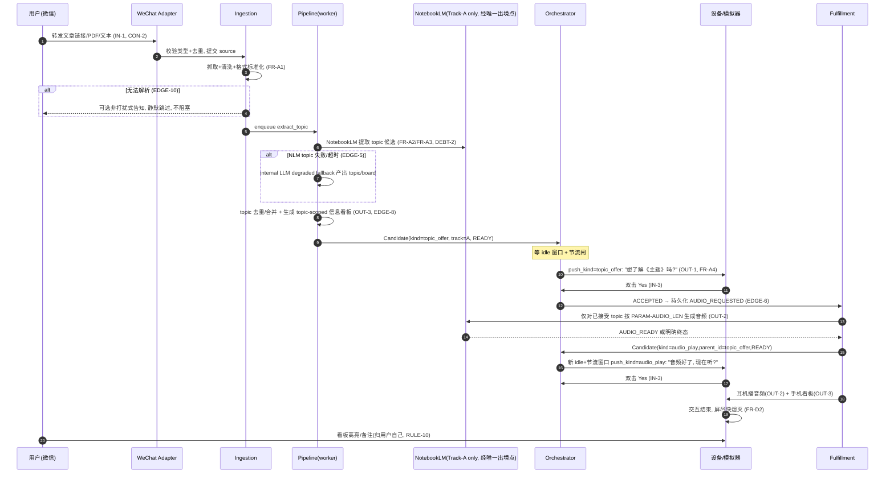
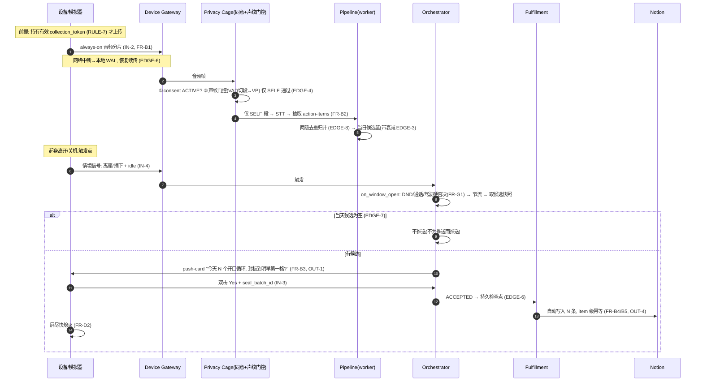

# Demo Design · Always-on 可穿戴硬件 ·「开口循环 + 转发文章」全链路实现设计

> **本文是什么**：本 Demo 的**工程实现设计（design）**。它回答 `spec.md` §13 提出的全部 11 个「怎么做」：架构与数据流、模块拆分、状态机、关键接口、数据模型、为什么选 A 不选 B、性能/扩展/可靠性、风险与 trade-off。
> **与 spec 的关系**：`spec.md` 是**冻结的需求契约**（做什么/红线/验收）；本文只在**不违反** spec §8（12 条 RULE）、§11（CON/PARAM）的前提下作答。凡本文与 spec 冲突，以 spec 为准。
> **可信度声明**：本设计经过一轮多智能体子系统设计 + **对抗式契约审计**（针对全部 12 RULE / CON-5 / 11 条 EDGE 逐条红队），审计发现的 18 项 blocker/major 跨切片违约已收敛为单一设计立场（见 §A）。**核心方法论：把分散的概率性守卫，收敛为「单一权威点 + 结构性强制 + 失败关闭(fail-closed)」。**
> **锁定技术决策**：任务后端 = **Notion**；云端栈 = **Python + FastAPI(async) + arq**；设备 = **真实 ESP32-S3 固件 ∥ 协议兼容软件模拟器（同一协议）**；轨道 A 音频 = **NotebookLM（经开源库 `notebooklm-py`）**，封装在可热插拔 Provider 抽象之后。
> **状态**：Design v1 · **日期**：2026-06-22

---

## §0 设计思路 · 原则 · 接缝契约

### 0.1 设计思路（6 条核心理念）

1. **主动先递，禁止「让用户问」**（RULE-1 / FR-A4 / FR-A7 / FR-B3）。系统灵魂是云端在 idle 命中那一刻把卡推下去，而非任何检索/问答入口。这条理念向下决定了：传输选 WSS 长连（云端可主动下发）、MCP 续聊实现为「系统在 Yes 后递出的延续句柄」而非「用户枚举/检索记忆」。
2. **1-bit 极简 + 阅后即焚**（RULE-2/3/4/8）。设备被刻意压成「采集 + 1-bit + 熄屏」的哑终端；红线靠「**能力不存在**」保证——协议层无第四态、无 feed/红点/历史/launcher 字段、无连播消息类型，`time-to-dark` 是屏幕的唯一目标。
3. **对外只出加工结果，原始素材永不出端**（RULE-6 / CON-5④ / OUT-5）。这是零破例红线，靠**单一物理出境瓶颈 + 数据分级 + 失败关闭**三层强制，而非每切片各写一份概率过滤器。
4. **外部能力可热插拔，技术债显式记账**（CON-3 / DEBT-1..6 / AC-5）。NotebookLM/STT/LLM/声纹/Notion 全部封装在 Provider 抽象之后；每条妥协在运行期可见（DebtRegistry + 事件 + 数据标记），不被当作最终方案。
5. **隐私笼子前移到源头**（RULE-7 / CON-5 / EDGE-4/9）。同意是采集的唯一前置凭证；声纹门控置于 **STT 之前**；他人/未知语音不分析、不外传、限期清理；删除可被用户确认（含第三方副本状态）。
6. **克制优先于覆盖**（FR-G1/G2 / EDGE-3/5/7 / RULE-11）。宁可不推也不在热状态打扰；外部能力失败静默重试/丢弃、绝不报错弹窗；空候选不推；候选可衰减过期，不堆积成「待办债」；质量不进关键路径、不作成败标准。

### 0.2 设计原则（10 条工程原则，绑定 spec ID）

| # | 原则 | 绑定 |
|---|---|---|
| P1 | **单一权威点**：每条跨切片不变量只有一个执行点（见 §0.3） | RULE-6 / AC-2 / AC-3 |
| P2 | **结构性守约 > 运行期校验**：能用类型/DB 权限/协议白名单/「能力不存在」杜绝的，绝不降级为概率过滤器 | RULE-1/2/3/4/6/8 |
| P3 | **失败关闭（fail-closed）**：任何 `track/content_class/speaker_label` 缺失或未知的对象，在出境点一律 DENY | RULE-6 / EDGE-4 |
| P4 | **Yes 前零对外动作**：任何 `FULFILL_STARTED` 必须可回指同 `intent_id` 的 `FEEDBACK_YES`，且动作 ∈ 低风险白名单 `{notion.write}` | RULE-5 / EDGE-6 |
| P5 | **同意派生凭证是采集唯一授权**：`collection_token` 是上传音频的唯一凭据；设备自报 `consent:true` 仅为遥测 | RULE-7 / CON-5① |
| P6 | **声纹门控在 STT 之前**：仅 SELF 段进入转写/抽取/出境；foreign/uncertain 直接隔离不转写 | EDGE-4 / RULE-7 |
| P7 | **节流与单卡是全局串行约束**：per-user 单写者锁，一窗口至多一张卡；契约方向性上/下限在参数校验层不可突破 | FR-D1 / FR-G2 |
| P8 | **候选可衰减、Yes 后持久**：READY 候选 TTL 衰减过期；ACCEPTED 是持久检查点，至少一次幂等补完 | EDGE-3 / EDGE-6 |
| P9 | **话术来自受控话术库**：卡片措辞优先用审定 slot-filled 模板；禁词分类器仅作回归护栏 | RULE-9 |
| P10 | **技术债运行期可见**：每条 DEBT 至少一个在线 `surfaced_by` 机制 + CI 对账 | AC-5 / DEBT-* |

### 0.3 接缝契约（跨切片不变量 · single source of truth）

> 子系统独立设计时最容易出现「各写一套」的隐患（审计实证：曾出现 3 套不一致的出境守卫、2 套互相矛盾的声纹阈值、2 套 AC-2 公式）。本节钉死每条跨切片不变量的**唯一执行点**，所有子系统必须引用它，不得各自实现。

| 不变量 | 唯一执行点 | 说明 |
|---|---|---|
| **第三方出境** | `egress_to_external()`（§11） | NotebookLM/MCP/Notion 全部第三方出站只经此一函数；统一字段契约 `{track, content_class, speaker_label}`，fail-closed。底座=DB CHECK + MCP 只读角色物理隔离 |
| **声纹阈值** | `PARAM-VP_TAU_SELF / VP_TAU_FOREIGN`（§10 ParamStore） | 唯一一对阈值，self 偏高（保守）；§4/§9 只消费不自定义 |
| **超时 NO** | 设备上报为准（§2） | 云端 `schedule_timeout` 仅在该 `correlation_id` 无任何反馈时合成 NO |
| **AC-2 主动递接受度口径** | `MetricsEngine`（§11） | 同时计算 `yes_rate`、`non_annoyed_rate`、`composite_acceptance`；ABORT 剔除分母；§6 只发原始 feedback 事件 |
| **采集授权凭证** | `collection_token`（§9 签发） | 上传音频的唯一凭据；设备自报 consent 降为遥测 |
| **条目幂等键** | `user_id + action_item_id + business_day`（§7） | 独立于 `seal_batch_id`，使 ABORT→重弹→Yes 不重写同一 action-item |
| **业务日边界** | 本地 **04:00**（全系统统一） | §4 抽取、§5 DAILY_CAP 归零、§7 Notion `day_bucket` 一致取此定义 |
| **候选衰减参数** | ParamStore 单源（§10） | `CAND_TTL / DECAY_HALFLIFE / WEIGHT_FLOOR` 唯一定义，单一过期判定点 |
| **话术库** | §11 话术资产（审定模板 + 完整禁词词典） | §3 钩子、§5/§6 卡文案均取用；禁词分类器为回归护栏 |

### 0.4 Demo 分层：必做 / 可降级 / 目标态

> 面向长时间自动化生成代码的 harness 规则：agent 只能把“Demo 必做”当作当前实现承诺；“可降级实现”必须带事件/债务标记；“目标态”不得被误实现为 M0/M1 的阻塞项。这样既保留围栏，又避免过度工程化拖垮 Demo。

| 层级 | 当前含义 | 对实现的约束 |
|---|---|---|
| **Demo 必做** | spec 红线、两条旅程、1-bit 设备协议、唯一出境点、同意/停采/删除确认、Notion 幂等封板、MetricsEngine AC 口径、H1-H5/HT1-HT3 harness | 必须在 M0-M3 里以代码、测试或脚本门禁落地；不得用“后续再补”绕过 |
| **Demo 可降级实现** | 启发式 idle、假 Provider、NotebookLM/TTS/看板-only 降级、模拟器替代真机、简化删除 FSM、单密钥 + tenant 标签隔离 | 可用于达成 Demo，但必须 emit `DEBT_EXERCISED` 或在 DebtRegistry/事件中可见；不得宣称为真实产品完成态 |
| **目标态技术债** | 端侧隐私裁决、per-tenant DEK、strict RLS、完整 OpenTelemetry、真实偏好图谱、per-unit 独立发布体系 | 仅作为偿债方向记录；除非 task.md 明确列为本轮任务，否则不进入当前实现范围 |

---

## §1 端到端架构与数据流 · 部署拓扑

> 回答 spec §13 #1。本节是系统骨架，为 §2–§11 锁定组件边界、统一候选状态机、设备↔云协议、信任边界双闸、部署拓扑。

### 1.1 总体方案

整个系统是一条**事件驱动的「采集—理解—择时—1bit—履约」管线 + 中央 Orchestrator**。两条轨道（A 转发文章 / B 开口循环）的「候选提议」汇入**同一个 Orchestrator**，由它在**只在 idle（FR-G1）、受节流约束（FR-G2）**下决定**推哪条、何时推、推不推**，经设备 1-bit 卡收口（IN-3），Yes 之后才触发履约（RULE-5）。

选**事件驱动 + 异步 worker** 而非「同步请求-响应」的根因：两条主链路都是**长耗时、可失败、不可阻塞用户**的（NotebookLM 生成音频数十秒~分钟、STT 持续在跑、空闲窗口可能等数小时）。EDGE-5 明确要求「外部失败 → 静默丢弃或排队重试，禁止报错弹窗、不阻塞其它链路」——这天然是「任务队列 + 状态机」模型。

### 1.2 分层架构

```
┌──────────────── L0 设备层 (CON-1) ─────────────────────────────────────┐
│  ESP32-S3 固件 (real)  ∥  软件模拟器 (web/phone)  —— 同一 Device Protocol│
│  职责: always-on 录音上传(IN-2) / 1-bit 单卡+双击+超时+ABORT(IN-3,OUT-1) │
│        / 上报情境信号(IN-4) / time-to-dark(FR-D2) / 离线缓冲补传(EDGE-6)  │
└──────────────┬──────────────────────────────────────┬───────────────────┘
       WSS(主)+BLE(备)                          微信服务号(CON-2, IN-1)
               │                                       │
┌──────────────▼───────────┐              ┌────────────▼──────────────────┐
│ L1 Device Gateway         │              │ L1 WeChat Adapter              │
│  设备长连/鉴权/音频入口/卡 │              │  服务号回调, Track-A 原位捕获   │
└──────────────┬───────────┘              └────────────┬──────────────────┘
   音频/情境/反馈 │                                文章/PDF/文本 │
┌──────────────▼─────────────────────────────────────────▼──────────────────┐
│ L2 应用/编排层 (FastAPI async + arq workers)                               │
│  Ingestion · Privacy Cage(同意/声纹门控/隔离/删除)                          │
│  Understanding Pipeline:                                                   │
│    ├ Track-A: fetch→clean→topic/board→topic offer→按需音频→audio offer     │
│    └ Track-B: VP门控→STT→抽取→去重→候选缓冲                  (永不出境)     │
│  ★ Orchestrator(单写者): idle FSM + 触发 + 节流 + 择时 + 单卡               │
│  FeedbackSink + TimingBandit(只学择时)                                     │
│  Fulfillment: Notion封板(outbox幂等) / Track-A播放                          │
│  ★ S8 横切: ParamStore · TelemetryBus/MetricsEngine · ContractGuard ·      │
│             DebtRegistry · egress_to_external(唯一第三方出境点)             │
└──────┬───────────────────┬───────────────────────┬────────────────────────┘
       │                   │ (唯一第三方出境瓶颈)    │
┌──────▼──────┐  ┌─────────▼──────────┐   ┌─────────▼──────────┐
│ L3 数据层    │  │ L4 外部能力(热插拔)  │   │ L5 MCP Server       │
│ PG·Redis·OBJ │  │ NotebookLM(仅Track-A)│   │ content-only 只读角色│
│ 隔离桶+TTL   │  │ STT · LLM · Notion   │   │ 续聊句柄(RULE-6)     │
└─────────────┘  └─────────────────────┘   └─────────────────────┘
```

> **关键架构断言**：`Understanding Pipeline` 内部有**两条物理隔离的处理路径**——Track-A 文档路径（可经唯一出境点去 NotebookLM/MCP）与 Track-B 录音/转写路径（永不离开内部信任域）。两者共用队列基础设施，但**数据通道不交叉**（详见 §1.6 信任边界）。

| 组件 | 一句话职责 |
|---|---|
| 设备/模拟器 | 字节级等价双形态；采集 + 1-bit + 熄屏的哑终端 |
| Device Gateway | 设备长连鉴权、音频/情境/反馈入口、卡下发 |
| WeChat Adapter | 微信服务号回调，Track-A 原位捕获入口 |
| Privacy Cage | 同意 FSM、声纹门控(STT前)、隔离桶、删除作业 + 回执、出境守卫 |
| Understanding Pipeline | 两条物理隔离路径：A 文档(可出境) / B 录音转写(永不出境) |
| Orchestrator | 唯一发卡者：idle + 触发 + 节流 + 择时 + 单卡，串行决策 |
| FeedbackSink / TimingBandit | 回写 Yes/No/ABORT；只学择时不学内容 |
| Fulfillment | Yes 后 Notion outbox 幂等写入 / Track-A 播放触发 |
| MCP Server | content-only 续聊；独立只读 DB 角色，无 raw 凭证 |
| S8 横切层 | 参数热生效 + AC 指标 + RULE 断言 + 技债记账 + 唯一出境点 |

### 1.3 统一候选状态机（Orchestrator 核心）

两条轨道产出的提议在 Orchestrator 里抽象成统一 `Candidate`，走同一状态机——把「轨道 A/B 各异的生产过程」与「统一的择时-1bit-履约收口」解耦。`Candidate.kind ∈ {topic_offer,audio_play,track_b_seal}`；`audio_play.parent_id` 指向已接受的 `topic_offer`，使轨道 A 两阶段复用同一状态集而不新增状态。

```
[DRAFT] --生产完成--> [READY]
[READY] --被选中且 idle & 未超节流 & 时机合适--> [OFFERED] (卡已下发, 启 RESP_TIMEOUT)
[OFFERED] --双击 Yes--> [ACCEPTED] --履约完成--> [FULFILLED]
[OFFERED] --超时/无视 No (EDGE-1)--> [DECLINED]      (静默消失, 不重弹)
[OFFERED] --开口/来电/来消息 ABORT (EDGE-2)--> [READY] (退回候选池, 只调择时, 可再议)
[READY] --长期无空闲窗口/衰减过期 (EDGE-3)--> [EXPIRED]
[DRAFT] --外部能力失败超重试上限 (EDGE-5)--> [DISCARDED] (静默丢弃, 不报错)
[ACCEPTED] --设备离线/履约中断 (EDGE-6)--> [ACCEPTED]   (持久化, 恢复后补完, 绝不丢)
```

- `ABORT → READY`（非 DECLINED）：状态机层面强制 EDGE-2/FR-G3「ABORT 只调择时、不消耗内容」。
- `No → DECLINED 且不重弹`：EDGE-1 / RULE-3；但 `audio_play No/timeout` 表示「现在不听」，候选回到 `READY`，只可在全局 cooldown/daily cap 与 TTL 内有限重议。
- `READY` 有 TTL → `EXPIRED`：EDGE-3，候选衰减不堆积成待办债。
- `ACCEPTED` 是**持久化检查点**：EDGE-6，Yes 落库即进入 at-least-once 履约保证（§7）。

### 1.4 轨道 A 端到端时序



### 1.5 轨道 B 端到端时序



### 1.6 信任边界（RULE-6 / CON-5 红线，架构层强制）

```
┌────────── 信任域 A: 云端内部可信区 ──────────┐
│  可流转: 原始录音 / 逐字转写 / 文档原文 / action-item 意图
│  组件: Ingestion, Privacy Cage, STT, LLM, Pipeline, Orchestrator, DB, OBJ
│  录音/转写 只在此域内流动
└──────────────────────────────────────────────┘
        │  ★ 唯一出境点 egress_to_external()  (§11)
        │  统一字段闸: track / content_class / speaker_label  fail-closed
        ├──────────────────────────────┬───────────────────────────┐
        ▼                              ▼                           ▼
┌──────────────────────┐  ┌──────────────────────┐  ┌──────────────────────────┐
│ 第三方 NotebookLM     │  │ 任务后端 Notion        │  │ 外部 Agent (经 MCP)        │
│ ✅ 仅 Track-A 文章正文 │  │ ✅ 仅加工后的意图句     │  │ ✅ 仅 CLASS-2 内容层(track=A)│
│ ❌ 录音/转写/Track-B   │  │ ❌ 录音/转写/原文       │  │ ❌ 录音/逐字稿/他人语音      │
└──────────────────────┘  └──────────────────────┘  └──────────────────────────┘
```

工程化强制（非靠约定，三层底座共同支撑唯一出境点）：
1. **类型签名**：发往 NotebookLM 的入参类型只接受 `TrackADocument`（持 `clean_text`，无音频/转写引用）；Track-B 路径在代码层**根本不持有**任何 egress provider 引用。
2. **DB 物理隔离**：MCP Server 用**独立只读 DB 角色**，权限仅 `SELECT` content schema（CLASS-2），对 raw bucket / transcript / action_items.raw_quote **无授权**；`documents.origin CHECK(origin='track_a')` 使 Track-A 表里物理上不可能出现 Track-B 行。
3. **运行期出境守卫**：`egress_to_external()` 对每个出站对象校验 `track/content_class/speaker_label`，缺字段/非白名单/带 audio|transcript 标记/foreign 说话人 → 抛 `ContractViolation`（fail-closed，不静默降级），并记 AC-3 破例事件（`evidence` 不含原文）。

### 1.7 部署拓扑：单机 demo 优先

**单台云主机（single-box），Docker Compose 一键起，逻辑分层但物理共置。**

```
docker compose:
  • fastapi-app   (Device Gateway + WeChat Adapter + Orchestrator + 各 service, async)
  • worker        (arq: Pipeline / 履约 / 声纹门控 / NotebookLM)
       └ 含 Playwright+Chromium (~170MB, notebooklm-py 专用隔离 worker 池)
  • postgres      (元数据/状态机/候选/反馈/事件日志, RLS 行级隔离)
  • redis         (arq 队列 + 调度 + 在线状态 + 节流计数 + 参数缓存)
  • minio         (对象存储, 隔离桶, S3 兼容, per-tenant 前缀 + TTL)
  • mcp-server    (独立进程, content-only 只读 DB 角色)
反代: Caddy/Nginx → HTTPS (微信回调 + WSS 均需 TLS)
```

**为什么单机而非微服务**：①规模——spec §3.1 仅 3–6 名试用者、N3 不做量产硬件，无高并发/多区域需求；②目标——demo 验的是 G1 链路可行 + G2 主动递被接受，非容量/SLA，单机最快跑通、最易演示、最易整体清理（`docker compose down -v` 即净，对应 CON-5③）；③保留可拆分性——组件已按层 + Provider/队列/DB 解耦，将来拆服务无需重构。

**双形态并存**：真机固件与软件模拟器经同一 WSS 端点、同一 Device Protocol（§2.3）接入，云端不区分（仅 `device_class` 字段供观测）。硬件就绪用硬件、故障切模拟器，链路始终可测——直接服务 AC-1。

### 1.8 模块化单仓与可独立单元边界

本设计采用 **modular monorepo**：单仓保证 `spec/design/management`、协议、参数、隐私红线与契约测试在一个 PR 内原子同步。**单元目标按 demo 右尺度限定为三件事：可独立「构建 + 验证 + 产物定位」，再聚合为一次 demo 发布**。产物定位意味着每个单元有明确 build 输出或摘要（schema、bundle、image digest、firmware image、compose config），便于长时间自动生成后追查“哪个单元漂了”；但 Demo 阶段**不做 per-unit 独立 release**，最终仍只有一次 `docker compose` 聚合发布和一个 demo tag。Demo 阶段不拆多仓，原因是 3 人规模下多仓会放大协议漂移和发布编排成本；但单仓内部不能变成一个不可分的"大应用"。**本表是单元边界的唯一所有者**（management.md §3.2 引用本表，仅另加 Owner 列）。

> **骨架期状态**：下表是 M0 目标边界；当前 `.github/workflows/ci.yml` 仍是**单体流水线**（非 per-unit matrix），per-unit 构建脚本随实现补齐（task.md T0.14）。读到本表不等于 per-unit 制品流水线或独立发布系统已存在。

独立单元的粒度按"可交付运行面/契约面"划分，而不是按人员或目录随意拆：

| 单元 | 源码边界 | 可定位产物（聚合为一次发布） | 独立验证 |
|---|---|---|---|
| `protocol-contracts` | `protocol/`, generated `simulator/src/protocol` | schema + 生成类型 + 生成摘要 | schema lint + 两端生成物 diff + 协议白名单 contract tests |
| `cloud-core` | `cloud/common`（含由 protocol 生成的 pydantic）, `cloud/contract`, `config`, `debt`, `cloud/telemetry` | 内部 Python 包或源码包摘要 | unit + contract + traceability/debt/param sync |
| `cloud-runtime` | `cloud/api`, `cloud/pipeline`, `cloud/orchestrator`, `cloud/privacy`, `cloud/fulfillment`, `cloud/providers` | `fastapi-app`/`worker`/`mcp-server` image digest | unit + integration + guarded compose build |
| `simulator` | `simulator/` | web/mobile simulator bundle + protocol fixture | `tsc`/eslint + protocol fixture + e2e fault injection |
| `frontend` | `frontend/` | board/consent UI bundle | `tsc`/lint + UI smoke + RULE-10 static checks |
| `firmware` | `firmware/` | ESP32-S3 firmware image + protocol conformance report | protocol conformance + device FSM tests; non-blocking until hardware ready |
| `infra-demo` | `docker-compose.yml`, `.github/`, `scripts/`, `migrations/` | compose 聚合配置 + CI gate 报告 | compose config/build, migration smoke, all sync hooks |

> **`cloud/common` 归属**：唯一归 `cloud-core` 单元。由 `protocol/` schema 生成的 pydantic 落 `cloud/common`，视为 **cloud-core 消费 protocol-contracts schema 的构建产物**（generator 属 protocol-contracts，产物落点属 cloud-core），不再让 `cloud/common` 同时挂在两个单元名下（修原"源码边界不相交"自相矛盾）。

依赖方向固定：`protocol-contracts` → `cloud-core` → `cloud-runtime`；`simulator/frontend/firmware` 只消费协议与 HTTP/WSS/OpenAPI 形状，不反向依赖云端内部模块。任何跨单元公共数据结构必须先落到接缝 K1–K11 或 `cloud/common`，禁止通过临时 import 穿透目录边界（此规则以**评审**强制——demo 规模不另加 import-linter 脚本）。最终 demo 以 `docker compose` 聚合发布；**git tag + commit SHA 已钉住全部单元**（monorepo 一个 SHA = 全单元），记录 compose build 落出的镜像摘要和前端/固件 bundle 摘要即可定位"协议变了、模拟器未更新"这类漂移；该漂移仍由 H4 协议无漂移闸 + 单 PR 原子同步覆盖，无需 per-unit release tag。

### 1.9 M0 风险 Spike（冻结接缝前必须验证）

M0 不是只写桩。为了让后续长时间自动化生成代码不建立在假前提上，以下风险必须在接缝冻结前以最小 spike 验证并记录结果；失败不改 spec，先在 task/ADR 中调整实现路径：

| 风险 | 最小验证 | 影响的接缝 |
|---|---|---|
| 微信服务号入口 | 回调验签、快速 200、链接/PDF/文本样例落 raw 并 enqueue | K5 / Track-A ingestion |
| NotebookLM / fallback | `notebooklm-py` 探活或明确不可用；验证 TTS/看板-only 降级可让 Document READY | K3 / DEBT-2 / EDGE-5 |
| Notion 履约 | 假 Provider + 一次真实沙盒写入路径，验证 item 幂等字段可落库 | K3 / K8 / RULE-5 |
| 设备/模拟器协议 | 最小 HELLO、CARD_PUSH、CARD_RESULT 往返；确认 `YES/NO/ABORT` 三态与无 feed 字段 | K1 / K5 / FR-D1 |
| 本地 dev harness | `uv run pytest tests/unit -q`、H1-H3、契约静态扫描、任务治理脚本在干净环境可跑 | K11 / infra-demo |

这些 spike 是 harness 稳定性的地基：只有外部能力、协议和本地验证链路被证明可运行，后续 agent 才能按接缝持续生成实现代码。

---

## §2 设备固件 + 软件模拟器

> 回答 spec §13 #2。设备是「哑终端 + 1-bit 阀门」：所有「该不该推、推什么、写哪里」都在云端；设备只负责①采集上传音频、②在云端授权下亮一张卡、③把双击/超时/打断变成 1-bit 结果回云、④尽快熄屏。把智能放云端，是满足 RULE-2/RULE-8 的**结构性手段**——设备没有「对话/启动器」能力，就破不了这两条红线。

### 2.1 两形态、一协议

- **DEV-FW**：真实 ESP32-S3 + 1.75″ AMOLED（ESP-IDF / FreeRTOS，C）。
- **DEV-SIM**：协议兼容软件模拟器（Web/手机，TypeScript）。

两者对云端**字节级等价**（除 `device_class` 字段）。模拟器既是 demo fallback，也是 CI 里对云端的协议一致性夹具（可注入「无网络/丢 ACK/重启/超时不操作」等用例自动跑 EDGE-1/2/6）。

**固件模块（FreeRTOS 任务）**：M1 AudioCapture（I2S→VAD→Opus→切片）、M2 Uplink（封帧/发送/离线写 WAL）、M3 LinkLayer（WSS 主 / BLE 备、心跳、序号/ACK、重连）、M4 CardFSM（1-bit 卡状态机）、M5 InputSense（双击检测、VAD 开口、来电/来消息中断）、M6 Display（绘卡/熄屏/TTD 计时）、M7 AudioOut（A2DP 中继云端音频到现成耳机）、M8 Consent（物理采集开关 + 采集指示灯 + 云指令）、M9 OfflineBuffer（LittleFS WAL）。

> **刻意不存在的模块**：无 feed/历史渲染器、无下一卡预取器、无端侧对话/ASR、无 App 网格 launcher。**用「不存在」结构性强制 RULE-2/3/4/8。**

### 2.2 1-bit 卡状态机（FSM）

```
IDLE → CARD_SHOWN → RESOLVING → DARK → IDLE
        ├─ double-tap (≤DOUBLE_TAP_WINDOW) → YES
        ├─ timeout    (=RESP_TIMEOUT)       → NO
        └─ speak/call/msg                   → ABORT
```

落红线的控制规则：
- **单卡保证**：`CARD_SHOWN/RESOLVING` 期间**丢弃**任何新到 `CARD_PUSH`（回 `CARD_REJECTED{busy}`）。云端无法用连推制造 feed。〔FR-D1, RULE-3〕
- **熄屏先于网络 ACK**：`RESOLVING→DARK` 的熄屏**先于** `CARD_RESULT` 的网络 ACK 完成；结果写 WAL 持久化后台重发，屏幕不被网络阻塞。〔FR-D2, PARAM-TTD, EDGE-6〕
- **ABORT 是本地一等公民**：M5 检测到开口/来电/来消息直接驱动 FSM 到 ABORT，**不经云端往返**，绝不「追问是否继续」。〔RULE-2, EDGE-2〕
- **YES 语义在云端**：设备只回 `result=YES`，本地**不履约任何对外动作**（写 Notion 由云端做）——结构性满足 RULE-5。
- **看门狗**：独立硬件 watchdog + `screen_on_guard`，任何态停留超 `ttd_max` 强制熄屏回 IDLE，防意外常亮。〔EDGE-11〕

### 2.3 设备↔云协议（Device Protocol，固件与模拟器共用）

- **传输**：控制面 + 推送面走单条 **WSS** 长连（双向、低延迟，云端可主动下发卡）；音频走 WSS 二进制帧（Opus@16kbps，~200ms/chunk）；备链路 BLE GATT（经配套手机中继）。
- **会话**：`HELLO`/`HELLO_ACK` 握手，协商 `epoch`（设备每次启动自增，区分重启后的 seq 空间）。

**上行（device→cloud）关键消息**：

```jsonc
// ★ HELLO 必须携带 collection_token（采集唯一授权凭证, §9）
{ "type":"HELLO", "device_id":"esp32-001", "device_class":"hw|sim",
  "fw_ver":"0.3.1", "epoch":42, "last_acked_seq":1380,
  "collection_token":"<signed-JWT>",   // ★ 无有效 ACTIVE token → Gateway 拒收音频
  "consent_telemetry":true,            // 仅遥测, 非授权依据 (P5)
  "caps":["audio.opus","a2dp","ble"] }
{ "type":"AUDIO_CHUNK", "seq":1381, "epoch":42, "ts_ms":..., "codec":"opus", "dur_ms":200, "vad":true }
{ "type":"CTX_SIGNAL", "ts_ms":..., "motion":"still|walk|vehicle", "in_call":false,
  "vad_active":false, "worn":true, "batt":0.82 }     // IN-4 原信号, 设备不判 idle
{ "type":"DEVICE_DOFF", "ts_ms":... }                // 摘下设备, FR-B3 关机触发本地兜底
{ "type":"CARD_RESULT", "card_id":"c_7f3a", "result":"Yes|No|ABORT",
  "ts_shown_ms":..., "ts_resolved_ms":..., "ttd_ms":740,
  "reason":"double_tap|timeout|speak|incoming_call|incoming_msg" }   // ★ 超时 NO 以此为准
{ "type":"CARD_REJECTED", "card_id":"...", "reason":"busy|consent_off|in_call" }
{ "type":"CONSENT_STATE", "consent":false, "action":"stop|delete_request", "ts_ms":... }
```

**下行（cloud→device）关键消息**：

```jsonc
{ "type":"HELLO_ACK", "session":"s_99", "audio_resume_from":1381,
  "config":{ "resp_timeout_s":20, "ttd_max_s":10, "double_tap_window_ms":350, "ctx_period_ms":5000 },
  "param_version":42 }                 // PARAM 下发, 可热调 (§10)
{ "type":"CARD_PUSH", "card_id":"c_7f3a", "track":"A|B",
  "push_kind":"topic_offer|audio_play|track_b_seal",
  "headline":"想了解《XX》吗?", "expires_in_ms":20000 }
{ "type":"AUDIO_STREAM_BEGIN", "card_id":"c_7f3a", "codec":"opus" }   // 随后下行 AUDIO_OUT → A2DP
{ "type":"CARD_RESULT_ACK", "card_id":"c_7f3a" }     // 设备据此删 result_wal
{ "type":"AUDIO_ACK", "ack_seq":1390 }               // 推进音频 WAL 截断点
{ "type":"CMD", "cmd":"stop_capture|delete_done|force_dark|reconfig", "args":{...} }
{ "type":"device-config", "param_version":42, "resp_timeout_s":20, "ttd_max_s":10, "ttl":86400 }
```

> **`HELLO_ACK.config` vs `device-config` 优先级**（避免两个载体同字段冲突）：`HELLO_ACK.config` 是**握手时的初始快照**（设备上线即装载）；`device-config` 是**热更新通道**（§10.3 改参后下发）。二者同携 `resp_timeout_s/ttd_max_s` 时，**以 `param_version` 更大者为准**（单调递增）；设备落 NVS 时记录 `param_version`，断网期间用最后一次为准。这是 §0.3「单源」纪律在协议层的落实。

`audio_ready` 只对 `push_kind=audio_play` 有意义且必须为 `true`；`topic_offer` 卡不得携带 `audio_ready`，避免主题提议被误读为音频已生成。

**协议层固化的 spec 约束**：反馈只有 `Yes|No|ABORT` 三态、**无第四态、无多轮字段**（RULE-2）；`CARD_PUSH` 一次只一张、无「下一条/列表/红点」字段（FR-D1/D3, RULE-3/8）；无「自动连播」消息类型（RULE-4）。Track-A 两阶段是两张独立 1-bit 卡，各自走 idle+全局节流，不在设备端形成会话态。

### 2.4 离线缓冲与重连续传（EDGE-6）

| 数据 | 持久化 | 丢失容忍 | 重连行为 |
|---|---|---|---|
| `AUDIO_CHUNK` | LittleFS ring-WAL（≥30min 容量） | 超容量丢最旧（音频可降级，呼应 EDGE-3） | 按 `seq` 从 `last_acked_seq+1` 续传 |
| `CARD_RESULT`（尤其 YES） | LittleFS **独立 WAL，至 ACK 才删** | **零容忍**（EDGE-6 不丢「Yes 未完成」） | 重连优先重发未 ACK 项，幂等键=`card_id` |

EDGE-6 责任拆分：**设备**保证 YES 不丢且可靠上送（双击瞬间写 WAL → 熄屏 → 后台指数退避重发至 ACK）；**云端**保证 YES→履约不丢且幂等补完（§7）。设备绝不在本地尝试履约（守 RULE-5）。

### 2.5 设备侧同意与撤回（与 §9 协同，EDGE-9 关键修正）

- 设备在未持有有效 `collection_token` 前，M1 **不启动音频采集**；上传必须携带 token，Gateway 校验签名 + 查 Redis 黑名单 + 查 `state==ACTIVE`。
- **物理采集开关**（M8）在**断网时也立即停采**，并**清除撤回时刻之后的 WAL 段**——不依赖云端 `stop_capture` 送达。云端入口丢弃是安全网，设备本地停采是主路径，使「采集」真正在源头停止（修审计 M7/EDGE-9：离网续录漏洞）。

### 2.6 关键取舍

| 决策 | 选择 | 理由 | 被拒方案 |
|---|---|---|---|
| 音频上行 | WSS 长连 + 二进制帧 | 单连双工承载音频+卡推送+ACK；ESP-IDF 成熟；模拟器零额外依赖 | HTTP POST（包头开销/需另开长轮询）、纯 MQTT（broker 运维、异栈） |
| 熄屏时机 | 先熄屏 + WAL + 后台重发 | 守 PARAM-TTD/RULE-4；可靠性靠本地 WAL + 幂等 | 等云 ACK 再熄（网络抖动违 TTD） |
| 智能位置 | 全放云端，设备哑终端 | 红线靠「无能力」保证；模拟器可字节级等价 | 端侧 idle/ASR（招致 launcher 蠕变, 超 CON-1） |
| 双击判定 | 本地 ISR + 时间窗 | 断网也能产生并 WAL 持久化 YES（EDGE-6 前提） | 云端判定（往返延迟、断网无法确认 YES） |

---

## §3 轨道 A 云端处理管线（转发 → 清洗 → 主题 → 音频 + 看板）

> 回答 spec §13 #3。覆盖 FR-A1/A2/A3、OUT-2/OUT-3，消费 IN-1。

### 3.1 设计立场

1. **管线是「流水线 + 状态机」**：每篇转发内容是一个 `Document`，走过固定 stage；每 stage 是**幂等、可独立重试、可独立失败**的 arq job，失败/超时**永不**回传用户错误（EDGE-5），只内部标 `discarded`/排队重试。
2. **NotebookLM 是 demo 主路径但不写死为核心**：Topic extraction 与按需 audio generation 默认使用 NotebookLM，经 Provider 抽象与唯一出境点；NotebookLM topic 失败时 internal LLM degraded fallback 仍需产出可推送 topic/board。fallback 只保可用性，不承诺跨文档 N:M 合并等价。
3. **第三方边界用类型 + 唯一出境点强制 RULE-6**：发往 NotebookLM 的载体只能是 `TrackADocument`，且经 §11 `egress_to_external()` 唯一出境点（统一字段闸）。

### 3.2 Document 状态机

```
RECEIVED → FETCHING → CLEANING → TOPIC_EXTRACTING → TOPIC_READY(topic+board) → topic_offer READY
              │           │              │                         │
       (EDGE-10 失败)  (不可读)    (topic/fallback 全失败)       (长期无空闲) → EXPIRED
topic_offer ACCEPTED → AUDIO_REQUESTED → AUDIO_GENERATING → AUDIO_READY → audio_play READY
                                      │                │
                                 (可恢复重驱)     (fallback/明确终态)
```

子产物状态（音频按需生成且允许独立降级）：`AudioState ∈ {NOT_REQUESTED, REQUESTED, RUNNING, READY(NotebookLM MP3), DEGRADED(fallback TTS), SKIPPED(看板-only), DISCARDED}`。

**关键控制规则**：**看板是 topic_offer READY 的必要条件，音频不是**。`topic_offer` 只要求 `topic.state==READY` 且 `board.state==READY`；音频只在主题接受后以 `AUDIO_REQUESTED` 进入慢异步窗口。该请求必须持久化并由 worker+sweeper at-least-once 重驱，满足 EDGE-6。

### 3.3 NotebookLM Provider（CON-3/DEBT-2 + 审计修正）

```python
@dataclass(frozen=True)
class TrackADocument:           # RULE-6: 唯一可发往第三方的载体类型
    document_id: str; title: str; clean_text: str; lang: str
    origin: str = "track_a"     # 运行期断言锚点

class AudioProvider(Protocol):
    name: str
    async def health(self) -> bool: ...
    async def generate_audio(self, topic: Topic, *, audio_len_minutes: int, timeout_s: int) -> AudioResult: ...
    # 抛 ProviderUnavailable/Timeout/RateLimited → orchestrator 重试或降级, 绝不冒泡到用户(EDGE-5)

class TopicExtractionProvider(Protocol):
    name: str
    async def health(self) -> bool: ...
    async def extract_topics(self, docs: tuple[TrackADocument, ...], *, timeout_s: int) -> TopicExtractionResult: ...

# 默认实现 NotebookLMAudioProvider: async Playwright, 经唯一出境点 + per-user SessionPool
```

**审计修正（B2 · CON-5③ 跨用户混存）**：`notebooklm-py` 用 Google 会话 profile 而非 API key。`SessionPool` **以 `user_id`（或 `demo_session`）为 key**，一用户的 notebook 绝不与他人共账号；每 source 记 `external_ref=notebook_id`；**音频下载后立即 `delete_notebook`**。若 demo 必须共账号，显式标 CON-5③ 偏离 + DEBT 并限定即用即删。

`notebooklm-py`（Playwright+Chromium ~170MB、逆向非官方 API、限流、仅原型）跑在**与 FastAPI 隔离的专用 worker 池**（独立容器带 Chromium），`asyncio.wait_for` 硬超时 + 进程看门狗，崩溃不拖垮 API。Topic extraction 与 audio generation 不依赖跨「主题提取→音频生成」保留 notebook 会话来保证一致性；音频输入必须条件化于已接受的 `topic_id` 与 document 集合。若后续实现共享 notebook 会话，须由 T0.16 spike 验证并标注对即用即删模型的偏离。

### 3.4 数据模型（关键表）

```sql
CREATE TABLE documents (
  id TEXT PRIMARY KEY, user_id TEXT, content_hash TEXT,    -- 入口幂等键 sha256(user+url/bytes)
  source_type TEXT, source_ref TEXT, state TEXT, lang TEXT,
  raw_blob_key TEXT, clean_blob_key TEXT,                  -- 对象存储 (DEBT-1: 仅 demo 上云)
  ready_at TIMESTAMPTZ, expires_at TIMESTAMPTZ,            -- EDGE-3 候选衰减
  purge_after TIMESTAMPTZ NOT NULL,                        -- CON-5③ 限期清理
  origin TEXT NOT NULL DEFAULT 'track_a' CHECK (origin='track_a'),  -- ★ RULE-6 DB 级护栏
  UNIQUE (user_id, content_hash));
CREATE TABLE topics (id TEXT PK, user_id TEXT, title TEXT, hook TEXT, summary TEXT,
  key_points JSONB, extracted_by TEXT, degraded BOOLEAN,
  purge_after TIMESTAMPTZ NOT NULL,
  origin TEXT NOT NULL DEFAULT 'track_a' CHECK (origin='track_a'));
CREATE TABLE document_topics (document_id TEXT, topic_id TEXT,
  purge_after TIMESTAMPTZ NOT NULL,
  origin TEXT NOT NULL DEFAULT 'track_a' CHECK (origin='track_a'),
  PRIMARY KEY(document_id, topic_id));
CREATE TABLE boards (topic_id TEXT PK, blocks JSONB, state TEXT,
  purge_after TIMESTAMPTZ NOT NULL,
  origin TEXT NOT NULL DEFAULT 'track_a' CHECK (origin='track_a'));
CREATE TABLE annotations (id TEXT PK, topic_id TEXT, user_id TEXT,  -- RULE-10 owner=用户本人
  kind TEXT, anchor JSONB, text TEXT, color TEXT);        -- 高亮/备注归用户, 可 export
CREATE TABLE audio_artifacts (topic_id TEXT PK, state TEXT, provider TEXT,
  provider_notebook_id TEXT, mp3_blob_key TEXT, duration_seconds INT,
  attempts INT, last_error_code TEXT,
  purge_after TIMESTAMPTZ NOT NULL,
  origin TEXT NOT NULL DEFAULT 'track_a' CHECK (origin='track_a'));  -- error 仅内部
CREATE TABLE candidates (id TEXT PK, user_id TEXT, track TEXT CHECK (track IN ('A','B')), kind TEXT,
  parent_id TEXT NULL, topic_id TEXT NULL, state TEXT, expires_at TIMESTAMPTZ,
  purge_after TIMESTAMPTZ NOT NULL,
  origin TEXT NOT NULL DEFAULT 'track_a',
  CHECK ((track='A' AND kind IN ('topic_offer','audio_play') AND origin='track_a')
      OR (track='B' AND kind='track_b_seal' AND origin='track_b')));
CREATE TABLE audio_requests (id TEXT PK, topic_id TEXT, parent_candidate_id TEXT,
  provider TEXT, audio_len_minutes INT, idempotency_key TEXT UNIQUE,
  attempts INT, state TEXT, last_error_code TEXT,
  purge_after TIMESTAMPTZ NOT NULL,
  origin TEXT NOT NULL DEFAULT 'track_a' CHECK (origin='track_a'));
```

新增/重建的 topic-scoped 表、`document_topics`、`audio_requests` 与 `candidates` 必须继承 CON-5③/RULE-6 底座：每行有 `purge_after` 或进入 Reaper `expires_at`/TTL 路径；Track-A 专属表带 `origin='track_a'`，`candidates` 这类统一表用 `track/kind/origin` 一致性 CHECK 表达跨轨归属；纳入以 `app.tenant_id` 为上下文的基础 tenant RLS policy，strict RLS hardening 后续偿还。`audio_requests.idempotency_key` 是存储型字段，按 `parent_candidate_id` 稳定派生，不随 provider/audio_len 重算。事件 payload、`last_error_code` 与 terminal reason 只存结构化 ID、provider/error code 与参数版本，不得存原文、清洗正文、逐字稿、音频内容或近逐字片段。

当前 M0 seam PR 只交付 schema/contract 形状与静态契约测试；`AUDIO_REQUESTED` worker+sweeper 重驱、AC-1 `recovery_rate` dashboard、board 生成链路和真实 NotebookLM→internal LLM fallback 编排随 T0.8/T2.x 实现，不能把绿 CI 解读为这些 runtime 行为已完成。

两阶段卡片不显示预计时长，故删除旧 `topics.est_minutes`；预计时长唯一真相源是 `PARAM-AUDIO_LEN`。若后续需要展示预计时长，渲染期读取 ParamStore；`audio_artifacts.duration_seconds` 只存生成后实际时长，不能回流为预计时长源。

**入口端点** `POST /ingress/wechat`：网关验签后只做「落 raw + 计算 hash + enqueue」，**永远快速 200**（微信回调 5s 超时），真正处理全在 arq 异步进行；用户侧只见服务号一句中性回执（如「收到，稍后在空闲时递给你」），绝不报错（EDGE-5/RULE-9）。

**钩子文案**（FR-A4「想了解《X》吗？」/ FR-A7「音频好了，现在听？」）由受控模板或受控 prompt 产出 + §11 话术库约束。旧设计反对把主题提取绑死在 NotebookLM 上；本 ADR 有意接受 demo 主路径使用 NotebookLM topic extraction，但必须通过 Provider 抽象、internal LLM degraded fallback、DEBT-2/R2 记账和 T0.16 spike 防止其固化为不可替换核心。

### 3.5 可靠性降级阶梯（自动，无人工）

主题层：`NotebookLM topic extraction` → `internal LLM degraded fallback` → `静默重试/丢弃`。fallback 只承诺可用性保底：至少产出可推送 topic 与看板；若无法复现跨文档 N:M 合并，可退化为逐文档 topic 并标记 degraded。

音频层：`NotebookLM MP3` → `tts_fallback MP3 (DEGRADED)` → `看板-only / 明确终态`。音频生成只对已接受 topic 调用，失败不向用户报错，且 `AUDIO_REQUESTED` 必须恢复到 `AUDIO_READY` 或明确 terminal state。

### 3.6 关键取舍

| 决策 | 选择 | 理由 | 被拒 |
|---|---|---|---|
| 音频路径 | 看板必成、音频可降级 | NotebookLM 一挂不致 AC-1 归零；质量非成败标准(RULE-11) | 音频作为 READY 硬前置 |
| 主题提取 | 独立可控 LLM | 钩子受 RULE-9 约束需可控 prompt；提取是关键路径需稳定 | 复用 NotebookLM mind-map artifact |
| 队列 | arq | 全链 async-native，worker 内直接 await | Celery（async 为嫁接、重型） |

---

## §4 轨道 B 开口循环抽取（声纹门控 → 转写 → 抽取 → 去重 → 候选缓冲）

> 回答 spec §13 #4。从 IN-2 起，到「一组去重、加权、可封板的当日候选意图」就绪为止。

### 4.1 管线（审计修正后的关键顺序）

```
设备/模拟器 ── IN-2 音频分段 ──► [M0] Ingest(落隔离桶, 不分析)
   │
   ▼ ★ 审计修正(B3/EDGE-4): 声纹门控在 STT 之前
[M2] Voiceprint Gate(VAD切段→说话人验证)  ── foreign/uncertain → 隔离桶(不转写/不分析/不外传)
   │ 仅 SELF 段
   ▼
[M1] STT Provider(abstract)  ── 转写(仅本人段), 带时间戳的 utterance
   ▼
[M3] Extractor(LLM, abstract) ── 滑窗批处理 → action-item JSON (FR-B2)
   ▼
[M4] Dedup/Merge ── L1 规范 key + L2 语义近似 (EDGE-8)
   ▼
[M5] Candidate Buffer(PG+Redis) ── 当日缓冲 + 衰减/过期 (EDGE-3)
   ▼
[M6] Seal Readiness API ── 供 §5; 空集→不推 (EDGE-7); Yes→ §7 Notion (OUT-4)
```

> **审计修正 B3（EDGE-4「不分析」时序）**：原先 STT→门控的顺序意味着他人语音被转写后才隔离——「转写」本身就是分析。修正为 **VAD 切段 → 声纹门控 → 仅 SELF 段进 STT**；foreign/uncertain 段直进隔离桶、**不转写**。若 provider 不支持 pre-STT 说话人验证，显式记 CON-5②/EDGE-4 偏离 DEBT，且永不持久化 foreign 转写。

### 4.2 候选状态机

```
ACTIVE ──decay<floor / TTL到期──► EXPIRED (EDGE-3, 不进封板)
  │再次说到/merge: 刷新权重+last_seen → 留 ACTIVE
  │Yes
  ▼
SEALED ──Notion写入成功──► COMMITTED
  │写入失败/离线
  ▼
SEAL_PENDING ──EDGE-6 恢复后补完──► COMMITTED
```
`SEAL_PENDING` 必须持久化、恢复后补完（EDGE-6）；写入只在 Yes 之后（RULE-5）。

### 4.3 声纹门控（与 §9 协同，阈值单源）

```python
class OwnerVerdict(Enum): SELF; OTHER; UNKNOWN
class VoiceprintGate(Protocol):
    async def classify(self, segment_audio_ref) -> GateResult  # {verdict, score, model_version}
```
- 阈值取 **§10 ParamStore 单源** `PARAM-VP_TAU_SELF / VP_TAU_FOREIGN`（修审计 M5/RULE-7：原 §4 的 0.75/0.45 与 §9 的 0.55/0.35 两套冲突 → 收敛为一对，self 偏高保守）。`score ≥ TAU_SELF → SELF`；`≤ TAU_FOREIGN → OTHER → 隔离`；之间 → UNKNOWN → **保守按 foreign 处理**。
- **保守降级**：模型未就绪/超时/出错 → 全部 UNKNOWN → 隔离。EDGE-4 是红线，失败方向选「不分析」（宁可漏抽不可错外传）。

### 4.4 抽取与去重

**抽取 Prompt 契约**（System 要点）：只抽本人说出口且未闭合的待办；禁臆造/补全/评判催促（RULE-9）；无项返回空数组；只输出 JSON。Output：

```jsonc
{ "action_items":[{
  "title":"跟财务核对那笔差旅报销", "verb":"核对", "object":"差旅报销",
  "raw_quote":"...",                  // ★ 仅内部字段, 永不外传(RULE-6); 数据层禁入对外 payload
  "source_utterance_ids":["utt_a"], "due_hint":"明天",  // 不解析成绝对日期, 避免臆造
  "confidence":0.86, "is_open_loop":true }]}            // false 丢弃
```

**两级去重（EDGE-8）**：
- **L1 规范化精确 key**：`dedup_key=sha1(normalize(verb)+"|"+normalize(object))`，normalize 去语气词、繁简归一、同义动词归并。命中→直接 merge，零模型成本，吃掉日常逐字/同义复述主体。
- **L2 语义近似**：L1 未命中者算 `title` embedding 近邻；`cosine≥PARAM-DEDUP_SIM(0.86)`→merge；`[0.78,0.86)` 疑似区间不自动并但降权（防误并「核对报销 vs 核对预算」）。

### 4.5 候选权重与衰减（EDGE-3）

```
weight(t) = base * decay(t)
base = clamp(confidence,0.3,1) * (1 + log1p(evidence_count)*EVID_BOOST)   // 反复说→更重要
decay(t) = 0.5^((now - last_seen_at)/PARAM-DECAY_HALFLIFE)                // 半衰期默认 6h
```
`weight < PARAM-WEIGHT_FLOOR` **或** `now ≥ created_at + PARAM-CAND_TTL(18h, 默认不跨业务日)` → EXPIRED。Track-A `topic_offer` 保持不跨业务日语义；`audio_play` 为支持「现在不听」后的下一合适窗口，允许跨一个业务日边界，但仍受 `created_at + PARAM-CAND_TTL` 绝对上限。早上随口一提、整天没再提的小事自然衰减掉；被反复说到的被 `evidence_count` 抵消而留住——不堆积成待办债。衰减参数取 **ParamStore 单源**（修审计：S1/S4/S5 三套衰减统一）。

### 4.6 封板就绪（供 §5，FR-B3/EDGE-7）

```
GET /v1/tracks/b/seal-readiness?user_id=...&trigger=leave_desk
→ { should_push:true, active_count:3,
    card_text:"今天 3 个开口循环, 封板到明早第一格?",   // 取 §11 话术库, 无说教(RULE-9)
    snapshot_id:"snap_...", items_preview:[{candidate_id,title},...] }
```
调用即生成**冻结快照**（按 `weight desc, created_at asc` 稳定排序定格），避免推送时与 Yes 时候选漂移；`should_push=false` 时不推（EDGE-7）；Yes 回调携 `snapshot_id` 交 §7 写 Notion（FR-B4 全自动）。

> **业务日边界统一**：本系统统一以**本地 04:00** 为业务日界（修审计：S4 的 04:00 / S5 的午夜 / Notion day_bucket 三处对齐），防跨午夜封板与节流归零错位。

---

## §5 空闲识别 / 触发 + 节流

> 回答 spec §13 #5。Track-A 与 Track-B 共用的主动推送中枢。**只决定「推不推 / 推谁 / 何时推」并发事件，不渲染卡、不写 Notion。**

### 5.1 总体方案

- **每用户单写者 Orchestrator**：所有「是否下发卡」由单一写者串行决策，杜绝并发双卡（FR-D1）、节流双计数（FR-G2）。实现为 **per-user 分布式锁（Redis `SET NX PX` 5s）+ 短事务**，不同用户并行、同用户串行。
- **信号驱动而非轮询**：idle 由 IN-4 事件驱动地推进 FSM；只在 `IDLE_CONFIRMED` 或冷触发命中时唤醒 Orchestrator。
- **学习离线化**：择时 bandit 参数异步更新，决策时只读已收敛参数（详见 §6）。

### 5.2 Idle FSM（带 HOLD 计时 + 硬否决）

```
IdleState: ACTIVE | SETTLING | IDLE_CONFIRMED | DND_BLOCKED | COOLDOWN_HOLD
ACTIVE --静态条件成立(still/非驾驶 + 无对话 + 非勿扰)--> SETTLING (启 idle_hold_timer=IDLE_HOLD)
SETTLING --计时到期且条件仍成立--> IDLE_CONFIRMED (emit idle.entered → 唤醒 Orchestrator)
SETTLING --任一条件破坏--> ACTIVE (取消 timer, 复位不累计)        ← HOLD 必须复位而非累计
任意态 --勿扰/驾驶/通话--> DND_BLOCKED (硬否决, Orchestrator 永不被唤醒)  ← FR-G1
IDLE_CONFIRMED --条件破坏--> ACTIVE (若有 in-flight 卡 → ABORT 路径, EDGE-2)
IDLE_CONFIRMED --已发卡--> COOLDOWN_HOLD (等 IN-3 或 RESP_TIMEOUT)
```

去抖：`motion_state` 用连续 N 采样一致才翻转；`in_conversation` 用 VAD 滑窗多数表决（DEBT-3 启发式）。`in_conversation` 是**纯 VAD bit，不含任何转写/语义内容**（RULE-6/CON-5 边界）。

### 5.3 冷状态触发点（FR-B3，Track-B）

```
end_of_day_score = Σ wᵢ·signalᵢ  (久坐静止→持续步行 / 离开 work_geofence / 摘下or关机 / evening_window / 日历最后日程结束)
≥ θ_eod → trigger.fired(kind=END_OF_DAY)
```

> **审计修正 M9（FR-G1 漏洞）**：END_OF_DAY **不绕过** idle 硬否决。`on_window_open` 入口对**所有触发（含 END_OF_DAY）**统一加 DND/通话/驾驶硬否决；END_OF_DAY 仅放宽 `timing_fit` 阈值（封板有时效，错过当天即流失），**绝不放宽 FR-G1 硬否决**。若收尾时刻处于通话/驾驶/勿扰，候选按 EDGE-6 保留至下次合适窗口，而非抢发。

### 5.4 Orchestrator 决策环

```python
async def on_window_open(user_id, trigger):           # trigger ∈ {IDLE, END_OF_DAY}
    async with per_user_lock(user_id, ttl=5s):        # 单写者, 保 FR-D1
        if idle.state(user_id) in (COOLDOWN_HOLD, DND_BLOCKED): return   # ★ 所有触发统一硬否决
        if in_call(user_id) or driving(user_id):       return           # ★ M9 修正
        t = throttle.load(user_id)                                       # FR-G2
        if t.last_push_at and now - t.last_push_at < t.cooldown*60: return
        if t.daily_count_today() >= t.daily_cap:        return
        cands = [c for c in candidate_store.active(user_id, eligible_trigger=trigger)
                 if c.state=="pending" and now < c.expires_at]           # EDGE-1/3/8
        if not cands:                                   return           # EDGE-3/7 空候选不推
        ctx = context_bucket(user_id, now)                               # §6.1
        gate = TIMING_GATE_EOD if trigger=="END_OF_DAY" else TIMING_GATE_IDLE
        if bandit.score(user_id, ctx) < gate:           return           # 时机不佳→推迟(EDGE-3)
        best = max(cands, key=lambda c: c.effective_priority(now))
        if best.kind == "topic_offer":
            card = build_card(best, push_kind="topic_offer", resp_timeout=PARAM_RESP_TIMEOUT, context_bucket=ctx)
        elif best.kind == "audio_play":
            card = build_card(best, push_kind="audio_play", audio_ready=True, resp_timeout=PARAM_RESP_TIMEOUT, context_bucket=ctx)
        else:
            card = build_card(best, push_kind="track_b_seal", resp_timeout=PARAM_RESP_TIMEOUT, context_bucket=ctx)
        best.state = "in_flight"; throttle.record_push(user_id)
        idle.transition(user_id, COOLDOWN_HOLD)
        await emit("push.card", card)                   # → §2 设备
        schedule_timeout(card.correlation_id, PARAM_RESP_TIMEOUT)        # 超时仅在无反馈时合成 NO
```

`PushCard` schema **无** `next_card / history / unread_count` 字段——RULE-3/4/FR-D2/D3 在 schema 层就不可违反（P2）。`topic_offer` 和 `audio_play` 均独立走 idle/cooldown/daily-cap；第二推不是 topic 卡后的自动续播、下一条或预问，因此不新增 RULE-2/FR-D2/RULE-4 例外。

### 5.5 关键取舍

| 决策 | 选择 | 理由 | 被拒 |
|---|---|---|---|
| idle 判定 | 带 HOLD 计时 FSM + 滞回 | 表达 PARAM-IDLE_HOLD 连续静置；抗 IN-4 噪声 | 瞬时布尔（抖动误判打扰） |
| 并发控制 | per-user 短锁单写者 | 双卡/节流双计数须在决策时刻互斥（非落库去重） | 无锁乐观并发（第二张卡已发到设备才回滚） |

---

## §6 反馈回写 + 择时学习（只学择时，不学内容）

> 回答 spec §13 #7。

### 6.1 反馈控制流

```
IN-3 (Yes/No/ABORT, correlation_id) → FeedbackSink (只发原始 feedback 事件, 不算 AC-2):
  Yes   → 写 FEEDBACK_YES;
          kind=topic_offer: 持久化 AUDIO_REQUESTED 并触发按需音频生成;
          kind=audio_play: 触发播放履约;
          kind=track_b_seal: emit fulfillment.trigger; bandit.update(ctx, +1)
  No    → 写 FEEDBACK_NO;
          kind=topic_offer/track_b_seal: candidate.suppress(短期TTL退避, 非永久);
          kind=audio_play: candidate READY, 仅在 cooldown/daily cap/TTL 内有限重议
  ABORT → 写 FEEDBACK_ABORT; 候选保留(不 suppress); bandit.update(ctx, W_ABORT)  ← EDGE-2 只调择时
超时(无 IN-3) → 等价 No (EDGE-1); 但 ★ 仅在该 correlation_id 无任何设备反馈时由云端合成
```

> **审计修正 M3（超时 NO 单权威）**：以**设备上报**为准，云端 `schedule_timeout` 仅在到期且**未收到该 `correlation_id` 任何反馈**时合成 NO；`feedback_event.correlation_id` 唯一约束 + 先到优先后到丢弃。避免设备超时 NO 与云端合成 NO 双写污染 AC-2 分母。

### 6.2 择时学习（TimingBandit · DEBT-4 实现）

学习输入**只有时间情境特征**，结构上无法学内容偏好（EDGE-2/DEBT-4/N2 的硬保证）：

```python
def context_bucket(user_id, now) -> str:
    return ":".join([weekday_or_weekend(now), hour_bucket(now),     # 无 candidate_id/track/headline/内容标签
                     last_motion_before_idle, geofence or "unk", trigger_kind])
# 例: "wd:6:post_walk:transit:IDLE"
```

每个 `(user_id, context_bucket)` 维护一个 Beta 分布（Thompson sampling）：决策 `score()=beta_sample(α,β)`（自带探索）；反馈 `update()`：YES→`α+=1`，No→`β+=W_NO`，ABORT→`β+=W_ABORT`（`W_ABORT < W_NO`，ABORT 只给择时弱负信号）。`α/β` 随 `last_update` 缓慢衰减（作息会变）。

**为什么 Thompson/Beta-Bernoulli 而非监督分类器**：本轮 3–6 用户 × 个位数交互/天，监督模型严重欠数据必过拟合且只利用不探索；且特征一旦掺内容就滑向「学内容偏好」违 N2/EDGE-2。Thompson 冷启动稳、自带探索、**结构上只接受 context-bucket**，把红线编码进模型形状。

**可降级**：`LEARNING_ENABLED=false` 时 `score()` 退化为固定时段判断——证明它是临时增益而非不可替换核心（偿付 DEBT-3/DEBT-4）。

### 6.3 ABORT vs No 的处置分野（EDGE-2 核心）

No → `suppress`（短期 TTL 退避，不永久；EDGE-1）；ABORT → 候选**保留可重议**，只把弱负 reward 喂给 bandit 的**择时维度**，绝不触碰内容偏好（系统压根没有内容偏好维度）。这是 EDGE-2「ABORT 只调择时、不调内容」的结构性保证。

---

## §7 Notion 封板写入（全自动 + 幂等）

> 回答 spec §13 #6。封板是 **RULE-5 唯一允许的对外动作**（写入用户自己的任务后端，低风险可逆）。

### 7.1 方案：事务性 Outbox + 幂等 Upsert + 异步 worker

难点不是「调一次 Notion API」，而是 **EDGE-6**：Yes 已收到但写入未完成（掉线/崩溃/Notion 5xx/限流）时，必须恢复后补完且不重复。

```
设备 Yes → POST /v1/seal/confirm
  ① 一个 DB 事务内: 校验 seal_batch=PENDING_CONFIRM → 置 CONFIRMED → 为每 item 写 outbox(PENDING)
  ② 提交后 enqueue arq job (快路径)
  ③ 立即返回 202 (不等 Notion, 守 PARAM-TTD)
arq worker notion_writer: 取 outbox → check-then-create → 回写 DONE + notion_page_id
arq cron sweeper(30s): 捞所有 PENDING/卡住行重投 ← EDGE-6 恢复保证(不依赖 enqueue 是否成功)
```

入站确认只做一件事：把「该写」原子持久化进同一 DB 事务（batch 状态翻转 + outbox 落盘）。Notion 写入永远异步。事务提交了 sweeper 必补完；没提交就当 Yes 没收到，按设备重连补发处理。

### 7.2 字段 schema 与幂等键（审计修正后）

Notion Database `Open Loops 封板`，一条 action-item = 一个 page。字段：`Title`（加工后意图句，非逐字稿）、`Status`（Inbox，供用户自行流转）、`Captured At`、`Sealed At`、`Source`（固定 `open-loop`）、`Idempotency Key`、`Demo Tag`（`DEMO`，供一键清理）。**刻意不写**：无 `Transcript`/`Audio URL`/`Raw Snippet`——Notion 是第三方，只收内容层加工结果（RULE-6）。

> **审计修正 M4（item 幂等独立于 batch）**：
> - 批次级幂等键 `seal_batch_id`：挡设备重传（同 batch 重发 Yes → 命中已 CONFIRMED → 200 no-op）。
> - **条目级幂等键 = `sha256(user_id : action_item_id : business_day)`**（**不含 `seal_batch_id`**）。使 ABORT→重弹→Yes 即便分配了新 batch 也不会重写同一 action-item。配合：§4 把已封板 item 标 `boarded`，排除出后续 batch。
> - worker 写 Notion 前按 `Idempotency Key` query 一次（check-then-create），补 Notion「create 无幂等」；`notion_outbox.item_idempotency_key` 上 DB UNIQUE 为第一道闸；`SELECT ... FOR UPDATE SKIP LOCKED` 消除并发 TOCTOU。

`backoff = min(60s, 2^attempts*2s)` + 抖动，`max_attempts=8`；令牌桶限速贴合 Notion ~3 req/s，优先 `Retry-After`。超限进 DEAD 死信 + 可观测告警，**绝不向用户报错**（EDGE-5）。

---

## §8 MCP 续聊接口 + RULE-6 守卫

> 回答 spec §13 #8。把「某主题的内容」包成独立 MCP Server 进程（`udemo-mcp`，官方 `mcp` SDK），外部 Agent 就该主题续聊（RULE-2：多轮只在外部 Agent）。

### 8.1 RULE-6 硬隔离（数据分级 + 物理隔离 + 唯一出境点）

最关键的不是「暴露多少」，而是 MCP **物理上拿不到原文**：

| 分级 | 内容 | MCP 可见 | 落地 |
|---|---|---|---|
| CLASS-0 RAW | 原始录音、逐字转写、原文全文 | **绝不** | 独立 bucket，MCP 无凭证 |
| CLASS-1 DERIVED-SENSITIVE | 含可定位原文的片段/引文/时间戳 | **绝不** | 标 `sensitive`，不进 content store |
| CLASS-2 CONTENT | 主题、要点、看板结构、音频脚本摘要 | **可** | content store，MCP 只读这层 |
| CLASS-3 PREFERENCE-VERDICT | 偏好裁决（最终形态） | 本轮不做 | **DEBT-6** |

- MCP 进程 DB 角色**只对 content schema 有 SELECT**，对 raw bucket/transcript 表无凭证（第一道、最强防线：根本拿不到原文）。
- **续聊只服务轨道 A**（用户转发的文章；FR-A6/旅程一第 6 步均落轨道 A）。轨道 B 录音的任何内容层只进 Notion（给用户自己），**不进 MCP**——`track!="A" → 拒绝暴露`。
- 所有 MCP 出站经 §11 **唯一出境点** `egress_to_external()`（统一字段闸）。

### 8.2 续聊形态（审计修正 M1/M2）

> **审计修正 M1（RULE-1 去检索化）**：**删除 `list_topics()` 枚举接口**（可列举全部主题 = 等同可检索的记忆库，违 RULE-1）。续聊改为「**系统递出的延续**」：在用户 Yes 履约该主题时，系统向外部 Agent 投递一个**一次性续聊句柄**（短期 token，scope 仅该 `topic_id`）。`ask_about_topic` 的 `topic_id` **必须来自该下发句柄**，不可由用户/Agent 构造枚举。

> **审计修正 M2（RULE-6 RAG 近逐字风险）**：`ask_about_topic` **优先非生成式**——返回预计算的 `discussion_seeds`（纯内容层）。若保留生成式，约束为 summary-level，且把 verbatim 启发式跑在**其输出**上（不只跑在存储字段上），全部经唯一出境点记录。

保留的能力（均 CLASS-2、track=A、经句柄授权）：`resource topic://{id}/overview`、`resource topic://{id}/board`（不暴露用户高亮/备注，RULE-10）、`tool get_topic_brief(topic_id)`、`tool ask_about_topic(topic_id, question)`。**刻意不存在**：`get_transcript/get_recording/get_raw_source` 及任何返回原文 URL/逐字内容的接口（RULE-6 判定：接口面上不存在该能力）。

> **句柄如何到达外部 Agent（旅程一第6步的可演示路径）**：用户对轨道 A 卡片 `Yes` 履约后，系统在**手机信息看板（OUT-3）**底部出示一条**一次性续聊入口**——即上述短期 token 拼成的 MCP 连接串/深链（形如 `udemo-mcp://connect?topic=<id>&grant=<token>`，或一句"在 ChatGPT/Claude 里添加此 MCP 连接续聊"的可复制串）。用户把它贴进外部 Agent 即建立到 `udemo-mcp` 的连接，`ask_about_topic` 仅接受该句柄内的 `topic_id`。**它是系统在 Yes 后递出的延续，不是可枚举/检索的入口**（守 RULE-1）；句柄一次性、短寿命、scope 仅该 topic。这把 FR-A6 从"隐含"补成端到端可走查。

### 8.3 关键取舍

| 决策 | 选择 | 理由 | 被拒 |
|---|---|---|---|
| RULE-6 防护 | 物理隔离(无 raw 凭证)为主 + 守卫为辅 | 零破例红线不能靠概率过滤；最坏 MCP 被攻陷也够不到原文 | 纯出站内容过滤（先拿原文再努力不漏） |
| 续聊形态 | 系统下发一次性句柄 | RULE-1：续聊=递出的延续 | list_topics 枚举（等同记忆检索） |

---

## §9 隐私实现（同意 / 声纹门控 / 隔离 / 删除 / 限期清理）

> 回答 spec §13 #9。落实 CON-5、RULE-7、RULE-6、EDGE-4/9、FR-G4。总纲：本设计是 **DEBT-1（原文上云）的临时合规外壳**——把应在端侧完成的隐私裁决暂搬云端，用 Privacy Cage 包裹，确保即便原文上云仍满足 CON-5 五项；所有上云动作打 `phase=demo` 标记（AC-5）。

### 9.1 隐私是一道强制网关（6 组件）

- **入口铁律**：任何原始音频帧落持久化前，必先过 `Consent Gate`（同意校验）→ `Voiceprint Gate`（声纹门控，§4 已前移到 STT 前）。两道闸全过才写「可分析区」。
- **出口铁律**：任何流向第三方的数据，必经 §11 唯一出境点（数据分类层物理拒绝 raw/transcript 出境，RULE-6）。
- **生命周期铁律**：所有原始素材带 `tenant_id + class + expires_at`，由 `Retention Reaper` 兜底清理（CON-5③）。

### 9.2 同意 FSM（RULE-7 ①，可撤回）

```
NONE --grant(手机端显式勾选+签名)--> ACTIVE --revoke/FR-G4一键停止/EDGE-9--> REVOKED
ACTIVE --consent 版本升级--> STALE --重新同意--> ACTIVE
REVOKED --关联删除请求--> PURGING --> PURGED
```

- **何时/如何**：首次配对强制走 consent flow；同意发生在**手机端**（设备屏受 RULE-3/8 约束不能承载长条款）；分项授权（见下）。
- **采集授权唯一凭证**：签发短寿命签名 JWT `collection_token`（claims: `tenant_id, device_id, scopes, exp`）。设备每次上传携带；M2 校验签名 + Redis 黑名单 + `state==ACTIVE`。**这是上传音频的唯一凭据**（修审计 M7：设备自报 consent 仅遥测）。
- **分项授权 scopes**（修审计 M·RULE-7/CON-5①，新增 location/calendar）：

```jsonc
{ "always_on_audio": true,        // always-on 录音(轨道B)
  "forward_articles": true,       // 转发文章(轨道A)
  "third_party_processing": true, // 允许把"我转发的原文"送 NotebookLM
  "task_backend_write": true,     // 允许封板写 Notion
  "location": false,              // ★ IN-4 可选增强 geofence (默认关, 绝不出境)
  "calendar": false }             // ★ IN-4 可选增强 日历(仅布尔, 默认关)
```

- **撤回立即性**：M2 每次写盘前查 Redis `consent:{tenant}:state`（毫秒级），不只依赖 token 过期；即便设备离线没收 `STOP_CAPTURE`，云端入口也丢弃后续帧（双重保险，配合 §2.5 设备本地停采）。

### 9.3 数据分类 + 隔离

| class | 内容 | 可出境 | 默认 TTL |
|---|---|---|---|
| `raw` | 原始音频/文件、原文快照 | **否** | `PARAM-RAW_TTL`（self 短；**foreign/uncertain 切到分钟级**，修审计 M·CON-5②） |
| `transcript` | 逐字转写、说话人分段 | **否** | `PARAM-TRANSCRIPT_TTL` |
| `derived` | 主题/要点/看板/音频/action-items | **是**（经唯一出境点） | `PARAM-DERIVED_TTL`（demo 场次结束） |

隔离：Postgres 行级 `tenant_id` + **基础 RLS**（单共享密钥，每请求 `SET app.tenant_id`）；对象存储 per-tenant 前缀。`data_assets` 表每行强制 `tenant_id, class, expires_at, speaker_label, external_ref`。

> **demo 右尺度（延后偿还，非本轮强制）**：per-tenant DEK 信封加密与 strict RLS hardening 是**目标态**强隔离；本轮 3–6 用户、每场 `docker compose down -v` 即清（CON-5③），demo floor 是基础 RLS + 单共享密钥 + per-tenant 对象前缀。`data_assets` 的 `tenant_id/class/expires_at` 列约束仍由迁移强制（这是限期清理与删除定位的底座，不延后）。

> **审计修正（CON-5② 旁人语音上云）**：always-on 上云本身会把旁人语音先上传才门控——这是 DEBT-1 衍生暴露面。缓解：foreign/uncertain 段 raw TTL 分钟级、SV 后最早云入口即丢、不持久化；**显式记为残留暴露面，不当作合规**。

### 9.4 删除 / 清理（EDGE-9 可被确认）

作业化删除 + tombstone 回执（非「直接 DELETE 完事」）：

```
deletion_jobs FSM: REQUESTED → RUNNING → VERIFIED → CONFIRMED
触发: 用户一键删除/撤回同意 | 单条删除 | TTL 到期(Reaper) | demo 结束全清(scope=tenant_all)
```

> **demo 右尺度（保留诚实回执，简化状态机）**：EDGE-9「删除可被确认」的承重部分是**诚实回执**（下方 M6：区分"本系统已删"与"第三方副本：成功/重试中/不可确认"）——**这部分不延后，是 RULE-7/EDGE-9 的合约底线**。但 4 态 `deletion_jobs` FSM 是目标态；**demo 可降级为 2 态**（`REQUESTED → DONE`，对本系统 DB/对象做 best-effort 删除 + 对 NotebookLM/Notion 发删除请求并如实标注"不可确认"），无需 VERIFIED/CONFIRMED 全套。第三方副本定位仍靠 `data_assets.external_ref`（保留）。

> **审计修正 M6（删除回执含第三方副本状态）**：`CONFIRMED` 必须含**第三方副本删除状态**，不只重 count 本系统 DB。原文经轨道 A 进了 NotebookLM、封板进了 Notion，产生**不完全掌控的副本**：① `delete_notebook(notebook_id)` / Notion 页归档（best-effort）；② `data_assets.external_ref` 记 notebook_id/page_id 供定向删除；③ 失败进 `FAILED` 告警。回执区分「本系统已删除」与「第三方副本：成功/重试中/不可确认」。Google 无删除确认 API 时，回执写「本地已删除；第三方副本删除已请求但不可确认」，**绝不无限定地报「已删除」**。

### 9.5 关键取舍

| 决策 | 选择 | 理由 | 被拒 |
|---|---|---|---|
| 声纹门控位置 | 云端 best-effort + STT 前 | CON-1 算力有限、本轮 DEBT-1 阶段；端侧 SV 超范围 | 端侧只传本人段（target 态，超 CON-1） |
| 删除 | 作业化 + tombstone 回执 | EDGE-9 须可被确认；覆盖慢/会失败的第三方副本 | 同步硬删返回 200（无法覆盖外部副本/无凭证） |
| 隔离 | 单库基础 RLS（单共享密钥）+ tenant 标签；per-tenant DEK 延后 | 3–6 用户、短周期；per-schema/DEK 运维成本不成比例 | per-tenant schema/库（规模化后再迁） |

---

## §10 关键参数落位（ParamStore）

> 回答 spec §13 #10。所有 PARAM-* 集中在单一配置面 + 热生效 + 设备下发。spec §11.2 明确「调数值不算改契约」，意味着校准频繁发生。

### 10.1 三层结构

```
[持久层] Postgres runtime_param (唯一事实源, append-only 版本化, 每次改值 INSERT 新版本行)
[缓存层] Redis param:current (热读, 全 worker 共享) + pub/sub param:changed 失效广播
[下发层] 云端: FastAPI 依赖注入 get_params() 进程内 5s TTL 缓存
        设备: 仅下发 RESP_TIMEOUT/TTD 两个本地判定参数, 经 device-config, 落 NVS, 断网离线判定
```

**为什么 append-only 版本化**：校准是科学实验。每个 metric 数据点钉住 `param_version`，否则「AC-2 这个 51% 在哪组参数下测出」不可复现。

### 10.2 PARAM 枚举、默认值（spec §11.2）、合法区间（审计修正）

| PARAM | 默认 | 角色 | 消费方 | **合法区间（对齐契约方向）** |
|---|---|---|---|---|
| RESP_TIMEOUT | 20s | 行为阈值 | 设备 + 云镜像 | [5, 120] |
| COOLDOWN | 60min | 行为阈值 | 推送编排器 | **[60, 1440]**（≥60，不可低于） |
| DAILY_CAP | 6 | 行为阈值 | 推送编排器 | **[1, 6]**（≤6，不可高于） |
| IDLE_HOLD | 60s | 行为阈值 | 空闲判定器 | **[60, 600]**（≥60） |
| TTD | 10s | 行为+验收阈值 | 设备自灭 + MetricsEngine | **[3, 10]**（≤10） |
| AUDIO_LEN | 12min | 行为阈值 | Track-A 音频生成 | **[5, 20]**（demo 目标 10–15min） |
| LINK_THROUGH | 0.95 | 纯验收阈值 | MetricsEngine only | [0, 1] |
| ACCEPT_TARGET | 0.50 | 纯验收阈值 | MetricsEngine only | [0, 1] |

新增内部参数（同样可调，遵循「调数值不算改契约」）：`VP_TAU_SELF`（默认 0.70，self 偏高保守）、`VP_TAU_FOREIGN`（默认 0.45）、`DEDUP_SIM`（0.86）、`DECAY_HALFLIFE`（6h）、`WEIGHT_FLOOR`（0.15）、`CAND_TTL`（18h）、`RAW_TTL`（self 短/foreign 分钟级）、`REAPER_INTERVAL`（10min）。

> **审计修正 M10（FR-G2 参数 bound 越契约）**：`PUT /admin/params` 把「越过契约上/下限」（如 COOLDOWN<60、DAILY_CAP>6）判为 **contract-affecting 改动并拒绝**，纳入 ContractGuard。前 6 个参数驱动行为；LINK_THROUGH/ACCEPT_TARGET 只是验收标尺，**运行链路代码无权读取**（否则=对着考试答案调系统）。

### 10.3 热生效

`PUT /admin/params/{key}`（admin token + 区间校验 + 审计 `changed_by/reason`）→ INSERT 新版本 → 重算 Redis → PUBLISH 失效 → 云端 5s 内重读；若 key∈{RESP_TIMEOUT,TTD} → 下发 `device-config` 给设备（模拟器同协议同步热生效）。设备上报反馈时带 `param_version`，云端检测滞后补发。

---

## §11 可观测性 + 契约破例监测

> 回答 spec §13 #11。横切层：统一参数源（§10）+ 统一事件总线 + 验收指标 + 契约红线断言 + 技债记账。**不拥有业务链路，但唯一出境点 `egress_to_external()` 在此。**

### 11.1 事件溯源（emit → event_log → 纯函数算指标）

业务模块只发原始事件（`await bus.emit(evt)` 写 Redis Stream，fire-and-forget，不阻塞主链路），后台 arq 落 Postgres `event_log`（append-only）。**为什么事件溯源**：AC-1..5 口径在校准期会变（「不反感」怎么定义、「贯通」算到哪一步、TTD 用 p90 还是均值），事件是原始事实、指标是其纯函数，口径变了重算历史即可。

统一 `Event`：`{event_id(幂等键), ts, type, track, intent_id(漏斗脊柱), user_id, param_version, source, payload}`。EventType 覆盖每一跳：`INTENT_CREATED / CONTENT_READY / CONTENT_FAILED / TOPIC_READY / AUDIO_REQUESTED / AUDIO_READY / IDLE_ENTERED / PUSH_THROTTLED / PUSH_SUPPRESSED / PUSH_SHOWN / FEEDBACK_{YES,NO,ABORT} / SCREEN_DARK / FULFILL_{STARTED,DONE,FAILED,RESUMED} / ANNOY_SIGNAL / MCP_TOPIC_SERVED / CONSENT_CHANGED / DATA_DELETED / CONTRACT_VIOLATION / DEBT_EXERCISED`。Track-A 不再用单一 `CONTENT_READY` 同时代表看板和音频；`PUSH_SHOWN.payload.push_kind ∈ {topic_offer,audio_play,track_b_seal}`，并由事件 seam 校验 `track/push_kind` 配对。新增事件 payload 只含结构化 ID、状态、provider/error code 与参数版本，不含原文、清洗正文、逐字稿、音频内容或近逐字片段；M0 递归拒绝敏感 key，近逐字片段语义检测随 ContractGuard/日志脱敏红队补齐。

### 11.2 AC 指标（唯一计算源 = MetricsEngine）

| AC | 度量 | 口径 |
|---|---|---|
| **AC-1** | Track-B 贯通率 = `reach(FULFILL_DONE)/reach(FEEDBACK_YES)` ≥ PARAM-LINK_THROUGH；Track-A e2e ≥1 | 分母从 FEEDBACK_YES 起算（No/ABORT 是用户选择，不算链路故障）；含 EDGE-6 迟到补完；旁路 `recovery_rate`。Track-A e2e 判定为 `TOPIC_READY → topic_offer PUSH_SHOWN → FEEDBACK_YES → AUDIO_REQUESTED → AUDIO_READY/明确终态 → audio_play PUSH_SHOWN → FEEDBACK_YES → FULFILL_DONE`；Track-A `AUDIO_REQUESTED` 崩溃恢复补完同样进入 `recovery_rate` |
| **AC-2** | 主动递接受度面板同时展示整体与按 `track`、`push_kind` 分层的 `yes_rate`、`non_annoyed_rate`、`composite_acceptance`；验收阈值默认看整体 `composite_acceptance ≥ PARAM-ACCEPT_TARGET` | **唯一计算源（修审计 M11）**：所有主动推送（`topic_offer`、`audio_play`、`track_b_seal`）均进入 `PUSH_SHOWN − ABORT` 主分母；`yes_rate = YES/(PUSH_SHOWN − ABORT)`；`non_annoyed_rate = (PUSH_SHOWN − ABORT − ANNOY_SIGNAL)/(PUSH_SHOWN − ABORT)`；`composite_acceptance = (YES ∪ (No 且无 ANNOY_SIGNAL))/(PUSH_SHOWN − ABORT)`；ABORT 剔除分母；§6 只发原始 feedback 事件；ANNOY_SIGNAL 仅择时信号、`method∈{explicit,heuristic,interview}` 分层 |
| **AC-3** | `violations==0` 按 RULE 维度展开 | ContractGuard（含 MCP 面）+ CI 静态断言；block 级自动止损；`evidence` 不含原文 |
| **AC-4** | `p90(TTD) ≤ PARAM-TTD` + `over_ttd_ratio` + max | 设备 `PUSH_SHOWN→SCREEN_DARK` 时间戳唯一源；「典型」取 p90 |
| **AC-5** | 6 DEBT 各有在线 `surfaced_by` + `exercised` 计数 | DebtRegistry + DEBT_EXERCISED + CI 对账 spec §12 |

### 11.3 ContractGuard（AC-3 守 12 RULE）

每条 RULE 归类 **PREVENT（执行前同步拦截、违则阻断）** 或 **DETECT（事后/CI 静态扫描）**：

| RULE | 断言 | 模式 |
|---|---|---|
| RULE-1 | API 路由 + **MCP tool 清单无枚举/检索类**；`ask_about_topic` topic_id 源自下发句柄（运行期校验，修审计 M12） | DETECT+PREVENT |
| RULE-2 | 每 intent 反馈 ∈ {YES,NO,ABORT} 至多一条；无多轮文本；无 ANNOY 内容维度 | PREVENT |
| RULE-3/4/8 | 协议消息类型 ⊆ 白名单（无 feed/红点/历史/launcher/连播/第四态）；并发 PUSH_SHOWN=1 | PREVENT+CI |
| RULE-5 | 任何 `FULFILL_STARTED` 必有同 intent `FEEDBACK_YES` + 动作 ∈ `{notion.write}`，否则**拒绝执行** | PREVENT |
| RULE-6 | `egress_to_external()` 唯一点：非 Track-A→NotebookLM DENY、raw 音频/逐字→DENY、缺字段→DENY | PREVENT |
| RULE-7 | 录音处理前有 ACTIVE collection_token；删除后有 DATA_DELETED | PREVENT |
| RULE-9 | 卡文案过 §11 话术库/禁词词典，DENY→中性模板回退（修审计 M8） | PREVENT |
| RULE-10/11/12 | RULE-11 已由静态扫描守质量字段；RULE-10/12 由 T0.13 补具名 contract/static tests 后进入 CI | DETECT/CI |
| 参数越界 | 越契约上/下限的改值请求拒绝 | PREVENT |
| 哨兵 | 任何 foreign-labeled 内容触达出境路径 → 即时告警 | PREVENT |

**唯一出境点**（RULE-5/6 两条最硬红线的集中执行）：

```python
async def egress_to_external(payload: ExternalPayload):   # 唯一允许向第三方发数据的函数
    if payload.dest == "notebooklm" and payload.track != "A":
        raise ContractViolation("RULE-6: only Track-A forwarded docs may reach NotebookLM")
    if payload.contains_raw_audio or payload.contains_verbatim_transcript:
        raise ContractViolation("RULE-6: raw recording/transcript must never leave")
    if payload.speaker_label in ("foreign", "uncertain"):
        raise ContractViolation("EDGE-4: non-self speech blocked")
    if payload.content_kind not in {"topic","summary","board","article_userfwd"}:
        raise ContractViolation("RULE-6: fail-closed on unknown content kind")   # P3 fail-closed
    ...  # 通过后才出站; NotebookLM 藏在 provider 抽象后 (CON-3/DEBT-2)
```

破例处置：block 级动作已被拒绝执行（自动止损）+ 实时告警；flag 级写库 + dashboard 计数。`evidence` 只存类型/指纹/长度（自身遵守 RULE-6）。

### 11.4 话术库（RULE-9 owner，修审计 M8）

§11 owns 一份**审定话术库**：有限 slot-filled 模板 + **完整禁词词典**（枚举而非示例：`又/该/别再/拖延/应该/居然`…等管教/评判模式）。§3 钩子、§5/§6 卡文案**必须取用**模板（RULE-9-clean by construction）；禁词分类器降为**回归护栏**。DENY 行为明确：**回退到中性模板**，绝不推被标文本、绝不静默丢弃，每次 DENY 进 AC-3 面板。

### 11.5 技术债记账（AC-5）

`DebtRegistry` 把 DEBT-1..6 物化为代码常量，启动时注册 + 校验「每条至少一个 `surfaced_by` 机制在线」。三种显式标注：①运行期事件（每走到妥协路径 emit `DEBT_EXERCISED{debt_id}`）；②数据/对象标记（上云对象带 `{debt, retention:demo, purge_after}`，MCP 出站带 `debt:DEBT-6`）；③启动自检 + CI 对账（spec §12 的 DEBT id 集合 == DebtRegistry，spec 加债则 CI 红，强制登记）。`GET /metrics/dashboard.ac5_debt.all_tagged` 为 true 当且仅当 6 条全部注册且机制存活。

| DEBT | 妥协 | 在本设计的 `surfaced_by`（运行期可见机制） |
|---|---|---|
| **DEBT-1** | 原文/音频（含旁人语音）上云明文处理 | 全链 `phase=demo` 标注；每条 IN-1/IN-2 入云 emit `DEBT_EXERCISED`；foreign 段 raw TTL 分钟级即判即弃（§9.3） |
| **DEBT-2** | 依赖第三方加工（NotebookLM 非官方/易 break；demo 主路径承担主题提取与音频生成） | Provider 抽象 + topic degraded fallback + 音频降级阶梯（§3.3/§3.5）；每次调用 emit `DEBT_EXERCISED`；失败计 EDGE-5 不报错；按需音频仅对已接受主题调用；`AUDIO_REQUESTED` 满足 EDGE-6 重驱 |
| **DEBT-3** | 空闲识别为启发式近似 | `IDLE_ENTERED.method='heuristic'` 标注；可降级固定时段表（§5.2/§6.2） |
| **DEBT-4** | 偏好/个性化只到「择时变准」 | context-bucket 物理无内容维度；bandit 只动 α/β；`LEARNING_ENABLED=false` 一键降级（§6.2） |
| **DEBT-5** | 护城河 / take-rate 整轮不做 | 对外动作白名单仅 `{notion.write}`（与 RULE-5 闸同锁），代码中**无任何交易/下单/转账路径**；ContractGuard 断言动作集 ⊆ 白名单（§7.1/§11.3） |
| **DEBT-6** | MCP 暴露内容层（CLASS-2），非「只吐偏好裁决」终态 | MCP 出站标 `debt:DEBT-6`；CLASS-3 偏好裁决留空显式记账（§8.1） |

新增 demo 期债 **DEBT-OBS-1**（建议登记）：admin 面单一静态 bearer token、无 RBAC、改值无双人复核——仅限 demo 可信操作者，进真实产品须偿还，已纳入 DebtRegistry 同款标注。

---

## §A 附录 · 契约合规裁决（18 项 blocker/major 收敛立场）

> 对抗式审计发现 45 findings / 18 blocker-major。下表为收敛后的单一设计立场（已落入上文各节）。核心：把分散的概率性守卫，收敛为「单一权威点 + 结构性强制 + 失败关闭」。

| # | 条款 | 问题 | 裁决（落位） |
|---|---|---|---|
| B1 | RULE-6 | S3/S7/S8 三套不一致出境守卫（字段名 origin/kind/track 各异） | 唯一物理出境点 `egress_to_external()` + 统一字段契约 + DB CHECK + MCP 只读角色底座（§1.6/§11.3） |
| B2 | CON-5③ | NotebookLM 共享 Google 账号跨用户混存 | SessionPool 以 user_id 为 key，即用即删 notebook（§3.3） |
| B3 | EDGE-4 | 声纹门控在 STT 之后（「不分析」时序破坏） | VP 前移到 STT 之前，foreign 不转写（§4.1） |
| B4 | CON-5② | always-on 上云旁人语音 | foreign raw TTL 分钟级、即判即弃、显式记残留暴露面（§9.3） |
| M1 | RULE-1 | MCP `list_topics` 枚举全部主题=记忆检索 | 删枚举，改系统下发一次性续聊句柄（§8.2） |
| M2 | RULE-6 | `ask_about_topic` RAG 可能合成近逐字 | 优先非生成式 discussion_seeds；生成式则约束 summary-level + 输出过 verbatim 启发式（§8.2） |
| M3 | AC-2 | 设备超时 NO 与云端合成 NO 双写污染分母 | 单一权威=设备上报，云端仅在无反馈时合成（§6.1） |
| M4 | EDGE-8/RULE-5 | ABORT→重弹→Yes 跨 batch 重写 Notion | item 幂等键独立于 batch（user+action_item_id+business_day）+ boarded 排除（§7.2） |
| M5 | RULE-7 | S4(0.75/0.45) 与 S9(0.55/0.35) 两套 VP 阈值 | 收敛为 ParamStore 单源一对，self 偏高（§4.3/§10.2） |
| M6 | EDGE-9 | 删除回执假确认（只重 count 本地） | CONFIRMED 含第三方副本删除状态，不可确认则如实标注（§9.4） |
| M7 | RULE-7 | 设备自报 consent 与 collection_token 双令牌 | collection_token 唯一凭证，自报 consent 降遥测（§2.3/§9.2） |
| M8 | RULE-9 | 无话术库 owner + 概率禁词守绝对红线 | §11 owns 审定话术库 + 完整禁词词典，分类器仅护栏，DENY→中性模板（§11.4） |
| M9 | FR-G1 | END_OF_DAY 绕过 idle 硬否决 | on_window_open 对所有触发统一 DND/通话/驾驶硬否决，EOD 仅放宽 timing_fit（§5.3/§5.4） |
| M10 | FR-G2 | 参数 bound 越契约（COOLDOWN下限1/DAILY_CAP上限50） | bound 对齐契约方向，越界改值判 contract-affecting 拒绝（§10.2） |
| M11 | AC-2 | S5 与 S8 两套接受率公式 | S8 MetricsEngine 唯一口径，删 S5 公式（§11.2） |
| M12 | RULE-1 | ContractGuard 断言不覆盖 MCP | 扩展到 MCP tool 清单 + 句柄来源运行期校验（§11.3） |
| 次1 | EDGE-1 | No 的 suppress 永久化 | 改短期 TTL 退避，可显著更优时机重议（§6.1） |
| 次2 | RULE-7/CON-5① | location/calendar 未在 consent scope | consent scopes 增 location/calendar（默认关，绝不出境）（§9.2） |

---

## §B 附录 · 可追溯性矩阵（spec → design.md 章节，零孤儿）

> **非权威人读视图**：本表供人理解"每条 spec 条款落在 design 哪一节"。机器可读的 spec-ID → owner/module/tests 唯一源是 `docs/traceability.yaml`（由 `check_traceability.py` 校验）；二者冲突以 traceability.yaml 为准。

| spec 条款 | design.md 归宿 |
|---|---|
| IN-1 / FR-A1 / CON-2 | §1.4, §3（WeChat Adapter / ingress） |
| IN-2 / FR-B1 | §2.3（AUDIO_CHUNK）, §4.1 |
| IN-3 / FR-D1 | §2.2/§2.3（CARD_RESULT 三态）, §6 |
| IN-4 | §2.3（CTX_SIGNAL）, §5.2 |
| OUT-1 / FR-A4 / FR-A7 / FR-B3 | §2.3（CARD_PUSH 单卡 + push_kind）, §5.3/§5.4 |
| OUT-2 / OUT-3 / FR-A5 | §1.4, §2.3（A2DP）, §3.4（topic-scoped board/audio/annotations） |
| OUT-4 / FR-B4 / FR-B5 | §7（Notion outbox 全自动幂等） |
| OUT-5 / FR-A6 | §8（MCP 续聊句柄） |
| FR-A2 / FR-A3 / FR-B2 | §3.2/§3.4（主题提取/topic-scoped 看板/按需音频）, §4.4（抽取） |
| FR-D2 / FR-D3 | §2.2（熄屏先于 ACK）, §2.3（协议无 feed 字段） |
| FR-G1 / FR-G2 / FR-G3 | §5.2/§5.3/§5.4（idle+硬否决+节流）, §6（反馈+择时） |
| FR-G4 | §2.5, §9.2/§9.4（停止/删除） |
| RULE-1 | §0.1, §5（无查询入口）, §8.2（去检索化）, §11.3 |
| RULE-2 | §2.2/§2.3（协议三态无多轮、Track-A 双卡独立 1-bit）, §8（多轮仅外部 Agent） |
| RULE-3 / RULE-8 | §2.1/§2.2/§2.3（协议白名单、无 launcher） |
| RULE-4 | §2.2（无连播、熄屏先行）, §11.2（TTD） |
| RULE-5 | §2.2（设备无对外动作）, §7（仅 Yes 后写 Notion）, §11.3（PREVENT guard） |
| RULE-6 | §1.6（信任边界）, §3.3, §8.1, §9.3, §11.3（唯一出境点） |
| RULE-7 / CON-5 / EDGE-9 | §2.5, §9（同意/声纹/隔离/删除回执） |
| RULE-9 | §3.4（钩子）, §4.4（抽取 prompt）, §11.4（话术库） |
| RULE-10 | §3.4（annotations 归用户）, §8.2（不暴露高亮） |
| RULE-11 | §3.1（音频可降级）, §11.2（无 quality 验收字段） |
| RULE-12 | §5（两轨同中枢同模型）, §8.1（B 不进 MCP）, §11.3（T0.13 具名测试） |
| EDGE-1 | §1.3, §6.1（topic No→DECLINED；audio No→READY 有限重议） |
| EDGE-2 | §1.3, §6.1/§6.3（ABORT 只调择时） |
| EDGE-3 | §1.3, §4.5（衰减/Track-A audio_play TTL 调和）, §5.4（无窗口宁可不推） |
| EDGE-4 | §4.1/§4.3（VP 前移 + 隔离）, §9.3, §11.3（哨兵） |
| EDGE-5 | §3.1/§3.5（topic fallback + audio 降级/明确终态）, §7.1（Notion 失败不报错） |
| EDGE-6 | §2.4（设备双 WAL）, §3.2/§3.4（AUDIO_REQUESTED 可恢复）, §7.1（outbox+sweeper） |
| EDGE-7 | §4.6, §5.4（空候选不推） |
| EDGE-8 | §3.4（Track-A topic 去重/N:M 映射）, §4.4（两级去重）, §7.2（item 幂等） |
| EDGE-10 | §3.2（DISCARDED + 非打扰式告知） |
| EDGE-11 | §2.2（看门狗强制熄屏）, §11.2（TTD max） |
| CON-1 | §1.2/§2.1（ESP32-S3 + 模拟器双形态） |
| CON-2 | §3.4（微信服务号入口） |
| CON-3 / DEBT-2 | §3.3, §9.1, §11.3（Provider 抽象热插拔） |
| CON-4 | §8（MCP 形态对外） |
| CON-5 | §9（隐私笼子五项） |
| PARAM-* / PARAM-AUDIO_LEN | §10（ParamStore 单源 + 区间） |
| DEBT-1..6 | §11.5（DebtRegistry 运行期可见） |
| AC-1..5 | §11.2（MetricsEngine 唯一计算源） |

---

> **实现边界说明**：本文是设计文档，给出后续实现的接口/数据模型/状态机契约骨架，**本轮不含实现代码**。代码落位建议：`cloud/api`（FastAPI 入口）、`cloud/pipeline`（arq workers）、`cloud/providers`（NotebookLM/STT/LLM/Notion/Voiceprint 抽象）、`cloud/orchestrator`、`cloud/privacy`、`cloud/telemetry`、`cloud/contract`（唯一出境点 + ContractGuard）、`config/params.py`、`debt/registry.py`、`firmware/`（ESP32-S3）、`simulator/`（协议兼容模拟器）。
